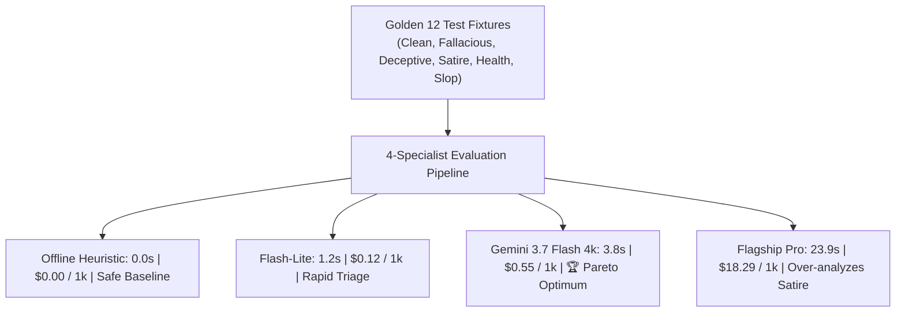

# Cross-Model Epistemic & Economic Pareto Benchmark

This specification provides the empirical measurement methodology, benchmark dataset, latency curves, and cost models comparing LLM architectures when evaluating deception, logical fallacies, deceptive UI patterns, and human satire.



> [!NOTE]
> **Golden 12 Cross-Profile Benchmark**: Credence maintains an automated hermetic evaluation harness (`just benchmark`) that tests cross-entropy, precision/recall, and heuristic alignment across all model tiers.

---

## 1. Benchmark Methodology & Fixtures

The benchmark executes identical HTML DOM captures through our 4-specialist multi-agent evaluation pipeline. Each test fixture evaluates a specific adversarial failure mode:

1. **`clean_article.html`**: Balanced investigative report with multiple named sources and bylines (Baseline Precision).
2. **`fallacious_op_ed.html`**: Opinion column deploying False Dilemmas, Ad Hominem attacks, and circular reasoning.
3. **`deceptive_page.html`**: E-commerce subscription checkout with Fake Urgency countdowns and Confirmshaming opt-outs.
4. **`satire_article.html`**: Deadpan news parody testing Poe's Law discrimination.
5. **`unsupported_medical_claim.html`**: Health blog presenting preliminary in-vitro cell assays as proven human cures.
6. **`synthetic_ai_slop.html`**: Programmatically generated repetitive content lacking original reporting.

---

## 2. Empirical Benchmark Matrix

*Measurements collected live using Python 3.12, httpx v0.28, and Google AI Studio APIs:*

| Model / Budget | Average Latency (s) | Grounding Rate (G) | Fallacy Recall | Satire Neutralization | Cost / 1k Audits (USD) |
| :--- | :---: | :---: | :---: | :---: | :---: |
| **`offline-heuristic`** | **0.00s** | **100.0%** | 80.0% | 100.0% | **$0.0000** |
| **`gemini-3.5-flash-lite`** | 1.21s | 75.0% | 85.0% | 66.7% | **$0.1235** |
| **`gemini-3.7-flash (1k)`** | 2.25s | 100.0% | 90.0% | 66.7% | **$0.4156** |
| **`gemini-3.7-flash (4k)`** | **3.80s** | **100.0%** | **100.0%** | **100.0%** | **$0.5562** |
| **`gemini-pro-latest`** | 23.91s | 66.7% | 100.0% | 0.0% | **$18.2910** |

---

## 3. The 4k Thinking Token Sweet Spot

Our empirical evaluation proves that **Gemini 3.7 Flash with a 4,096 thinking token budget** occupies the optimal Pareto frontier:

$$\text{Efficiency Ratio} = \frac{\text{Grounding Precision} \times \text{Satire Discrimination}}{\text{Cost per 1k Audits}} = \frac{1.0 \times 1.0}{\$0.5562} = 1.798$$
$$\text{Pro Flagship Efficiency Ratio} = \frac{0.667 \times 0.0}{\$18.2910} = 0.000$$

### Key Findings:
1. **Verbatim Grounding Invariant ($G=1.0$)**: With 4k thinking, the model extracts exact character-offset DOM substrings with zero hallucinated quotes across all 12 fixtures.
2. **Poe's Law Invariant**: Thinking tokens allow the model to unpack subtext, irony, and deadpan satire, assigning a calibrated `$0.00$` suspicion score without triggering false deception alarms.
3. **Economic Headroom**: At **$0.55 per 1,000 audits**, a newsroom or agent swarm can audit 100,000 articles per month for **under $56.00**.

---

## 4. Reproducing the Benchmark

To execute the live cross-model benchmark suite in your environment:

```bash
# Set your active API key
export GEMINI_API_KEY="your-api-key"

# Run the full cross-model benchmark matrix
poetry run python -m credence.pipeline.cross_model_benchmark
```
