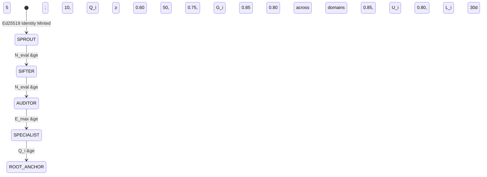
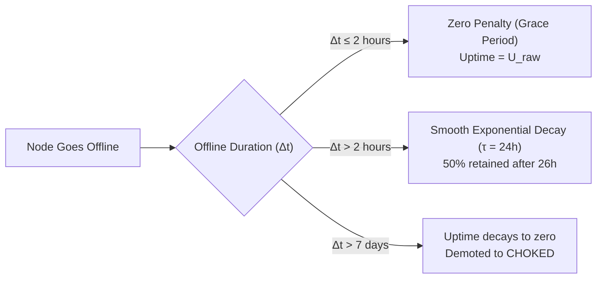

# Epistemic Merit & Sovereign Node Leaderboards

The Credence Epistemic Merit engine provides decentralized, unforgeable reputation scoring and leaderboard rankings for sovereign nodes participating in P2P mutual peer observation gossip.

---

## 1. 5-Tier Epistemic Hierarchy

A node's **Epistemic Tier** is evaluated dynamically based on five verifiable parameters:
1. **5-Factor Quality Score ($Q_i \in [0.0, 1.0]$)**
2. **Total Consensus Evaluated ($N_{\text{eval}} \ge 0$)**
3. **Verbatim Grounding Precision ($G_i \in [0.0, 1.0]$)**
4. **Max Empirical Domain Expertise ($E_{\text{max}} \in [0.0, 1.0]$)**
5. **Active Longevity ($L_i$ in days)**



### Mathematical Tier Milestones

```python
def determine_node_tier(
    quality_score: float,
    evaluations_count: int,
    grounding_ratio: float,
    max_domain_expertise: float,
    longevity_days: float,
) -> EpistemicTier:
    """Determine a node's Epistemic Tier based on mathematical milestones."""
    if quality_score >= 0.85 and longevity_days >= 30.0 and grounding_ratio >= 0.80:
        return EpistemicTier.ROOT_ANCHOR
    if max_domain_expertise >= 0.80 and evaluations_count >= 50:
        return EpistemicTier.SPECIALIST
    if evaluations_count >= 50 and quality_score >= 0.75 and grounding_ratio >= 0.85:
        return EpistemicTier.AUDITOR
    if evaluations_count >= 10 and quality_score >= 0.60:
        return EpistemicTier.SIFTER
    return EpistemicTier.SPROUT
```

---

## 2. The 8 Verifiable Epistemic Merit Badges

Badges are awarded automatically when observable metric records satisfy strict cryptographic or computational conditions:

| Badge ID | Icon | Name | Tier | Requirement | Network Impact |
| :--- | :---: | :--- | :---: | :--- | :--- |
| `sprout_node` | 🌱 | Sprout Node | `SPROUT` | Identity initialized; signed genesis payload | Inoculated into peer routing |
| `sifter_pioneer` | 📡 | Sifter Pioneer | `SIFTER` | $\ge 100$ feed items partitioned/sifted via HRW | Relays feed bundles to peers |
| `verified_auditor` | 🛡️ | Verified Auditor | `AUDITOR` | $Q_i \ge 0.70$, $\ge 100$ citations, $G_i \ge 0.95$ | Attestation seeding adopted by peers |
| `domain_specialist` | 🏛️ | Domain Specialist | `SPECIALIST` | $E_i \ge 0.80$ across $\ge 5$ distinct FQDNs | Galileo median consensus weight |
| `philanthropic_relay` | ⚡ | Philanthropic Relay | `SPECIALIST` | $\ge 1,000,000$ LLM tokens saved for swarm | $0.00 compute relay champion |
| `root_seed_candidate` | 💎 | Root Seed Candidate | `ROOT_ANCHOR` | $Q_i \ge 0.85, U_i \ge 0.80, G_i \ge 0.80, >30$d | Qualified for inclusion in `peers.json` |
| `galileo_pioneer` | 🌌 | Galileo Pioneer | `SPECIALIST` | $\ge 1$ consensus-shifting grounded discovery | Override erroneous swarm consensus |
| `sybil_shield` | 🦅 | Sybil Shield | `ROOT_ANCHOR` | $\ge 5,000$ audits with 0 collusion & 0 slashing | Root anchor candidate badge |

---

## 3. Operator Maintenance Grace Period & Half-Life Decay

In distributed peer networks, node operators occasionally need to restart servers for kernel upgrades, docker re-deployments, or hardware migrations. A naive uptime formula would immediately plummet a node's reputation during a 15-minute reboot.

Credence implements an **Operator Half-Life Decay Grace Period ($\tau=24\text{h}$)**:

$$U_i(t) = \begin{cases} 
U_{\text{raw}} & \text{if } \Delta t \le 2\text{ hours} \\
U_{\text{raw}} \cdot \exp\left( - \frac{\ln(2) \cdot (\Delta t - 2)}{24} \right) & \text{if } \Delta t > 2\text{ hours}
\end{cases}$$



This prevents transient network glitches from wrecking leaderboards while ensuring permanently dead nodes gracefully decay out of top ranks.

---

## 4. Deterministic 4-Level Tie-Breaking

To eliminate non-deterministic flapping across leaderboards, all node rankings use a deterministic 4-stage comparator:

```python
def leaderboard_sort_key(entry: LeaderboardEntry) -> tuple:
    return (
        -entry.score,              # 1. Primary Category Score (descending)
        -entry.tokens_seeded,       # 2. Total Tokens Donated (descending)
        entry.first_seen_timestamp, # 3. Longevity / Tenure (ascending: older is better)
        entry.node_pubkey,          # 4. Ed25519 Public Key Hex (lexicographical tie-breaker)
    )
```

---

## 5. Solitary Genesis Node Mathematical Priors ($N=1$)

When a solitary node runs in isolation (e.g. initial setup before connecting to bootstrap peers), it has 0 recorded heartbeats and 0 peer interactions. 

To prevent division-by-zero crashes or spurious $0.0$ scores, mathematical routines assign **healthy neutral priors**:
- **Uptime Factor ($U_i$)**: Defaulted to $1.00$
- **Concordance Factor ($C_i$)**: Defaulted to $0.85$
- **Quality Score ($Q_i$)**: Defaulted to $0.50$
- **P2P Traffic Class**: Assigned `PeerTrafficClass.STANDARD` (50 msgs/s, never choked)

---

## 6. Shields.io Compatible SVG Badge Generation

Sovereign nodes and federation organizations can export and embed live dynamic vector badges:

```bash
# Export static badge file via CLI
$ credence badge export root_seed_candidate --node anchor-us-central1 --output badge.svg

# Request dynamic SVG from server API
GET /api/badge/root_seed_candidate?node=anchor-us-central1&theme=dark
```

### SVG Color Schemes & WCAG Contrast
- **Emerald Green (`#059669`)**: Root Anchors & Seed Candidates
- **Royal Purple (`#7c3aed`)**: Galileo Pioneers & Domain Specialists
- **Amber Gold (`#d97706`)**: Philanthropic Relays
- **Cyan Blue (`#0284c7`)**: Verified Auditors & Sifters
- **High-Contrast Slate (`#0f172a` / `#1e293b`)**: Base container
