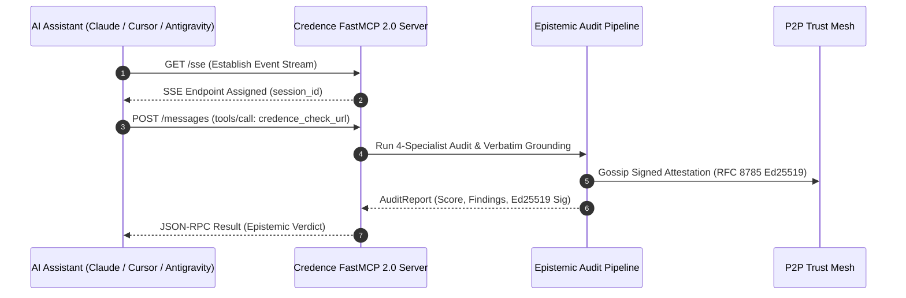

# FastMCP 2.0 Integration Specification

Credence implements a fully compliant **Model Context Protocol (FastMCP 2.0)** server allowing AI coding assistants (Antigravity, Claude Desktop, Cursor, and custom autonomous agents) to invoke epistemic tools and inspect live taxonomy resources.

---

## 1. Transports & Capabilities Supported

| Transport | Command | Use Case | Latency |
| :--- | :--- | :--- | :--- |
| **Standard I/O (`stdio`)** | `credence serve --transport stdio` | Local IDEs (Cursor, Claude Desktop, Antigravity) | < 1ms |
| **Server-Sent Events (`SSE`)** | `credence serve --transport sse --port 8000` | Remote Multi-Agent Swarms & GCP Cloud Run | Real-time Stream |

> [!IMPORTANT]
> **Reverse Proxy Security Settings**: When proxying FastMCP over Cloudflare or reverse proxies, configure `TransportSecuritySettings(enable_dns_rebinding_protection=False, allowed_hosts=["*"], allowed_origins=["*"])` to prevent `Invalid Host` rejections.

---

## 2. FastMCP Tool Catalog

### `credence_check_url`
Audits a live webpage against journalistic ethics, logical fallacies, and deceptive UI patterns.
- **Parameters**: `url: str`, `force_refresh: bool = False`, `cost_profile: str = "BALANCED"`
- **Output**: JSON payload containing `suspicion_score`, `classification`, `is_satire`, `violations`, and Ed25519 `node_signature`.

### `credence_evaluate_text`
Audits raw prose text directly without web scraping (zero network overhead).
- **Parameters**: `text: str`, `title: str = "Pasted Text"`, `byline: Optional[str] = None`
- **Output**: Full signed `AuditReport` JSON.

### `credence_get_audit`
Queries cached audits by URL or content SHA-256 in $0$ LLM tokens.
- **Parameters**: `identifier: str` (URL or SHA-256 hash)

### `credence_verify_attestation`
Cryptographically verifies an Ed25519 signed attestation.
- **Parameters**: `signed_attestation_json: str`
- **Output**: `{ "is_valid": true, "node_pubkey": "...", "content_sha256": "..." }`

### `credence_get_quota_status`
Returns real-time token safety headroom %, daily spend, and circuit breaker health.

### `credence_get_consensus`
Calculates Bayesian multi-node consensus across peer evaluations for a given content hash, with optional empirical subject-weighted scoring.
- **Parameters**: `content_sha256: str`, `subject_id: Optional[str] = None`

### `credence_discover_feeds`
Autonomously discovers RSS, Atom, and JSON feed candidate endpoints from any target webpage.
- **Parameters**: `target_url: str`
- **Output**: JSON array of discovered feed candidates with format type and verified status.

### `credence_inspect_feed_health`
Runs pre-flight forensic audit on a candidate feed to calculate Topic Entropy (\(H_{\text{topic}}\)), SPJ ethics compliance, and composite quality score (\(F_j\)).
- **Parameters**: `feed_url: str`
- **Output**: Detailed pre-flight audit report with status (`ACTIVE`, `PROBATION`, `QUARANTINE`).

### `credence_generate_digest`
Generates a structured daily Morning Epistemic Briefing from evaluated articles.
- **Parameters**: `hours: int = 24`
- **Output**: Executive briefing JSON with clean, warning, deceptive, and satire items plus compute savings.

---

## 3. FastMCP Resource URIs

- `credence://taxonomies`: Active taxonomy catalogs with SHA-256 hashes.
- `credence://profiles`: Operational cost profiles (`FREE`, `BALANCED`, `ULTRA`).
- `credence://node/identity`: Local node Ed25519 public key and reputation stats.
- `credence://mesh/seeds`: Signed bootstrap seed peers.
- `credence://subjects/registry`: Hierarchical subject domain ontology.
- `credence://feeds/status`: Syndicated feed status and compute savings.
- `credence://digest/morning`: Live 24-hour executive morning epistemic digest.
