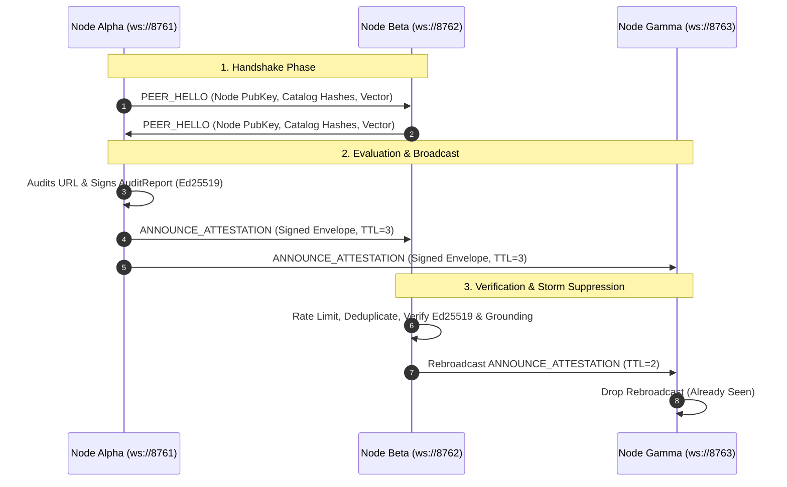

# Mesh Protocol & P2P Consensus

The **Credence Mesh** is an asynchronous, decentralized peer-to-peer trust network that enables independent Credence nodes to exchange, verify, and aggregate Ed25519-signed audit attestations over WebSockets.

---

## 1. Why Decentralize Epistemic Auditing?

Centralized truth or fact-checking APIs have fundamental flaws:
1. **Single Points of Failure & Censorship**: Centralized nodes can be blocked, DDoS'd, or politically coerced.
2. **Duplicative Compute / Token Waste**: If Node A already spent tokens auditing a breaking news article, Node B can verify Node A's cryptographic attestation and reuse the result in $0$ LLM tokens.
3. **Byzantine Fault Tolerance**: By gathering signed evaluations from multiple independent nodes and computing **Bayesian consensus**, the network eliminates rogue or compromised nodes.

---

## 2. P2P Gossip Protocol Specification

---

## 3. Node Quality ($Q_i$) & Empirical Expertise ($E_i$)

Every peer node is evaluated using a 5-factor quality score:
$$Q_i = 0.25 U_i + 0.30 C_i + 0.25 G_i + 0.10 T_i + 0.10 K_i$$

Where:
- $U_i$: Historical node uptime
- $C_i$: Consensus concordance
- $G_i$: Verifiable citation grounding ratio
- $T_i$: Latency performance
- $K_i$: Dynamic seed signature verification

Empirical authority ($E_i$) requires evaluation entropy across $\ge 5$ distinct FQDNs. Hallucinated findings incur an instant 50% reputation slash.
