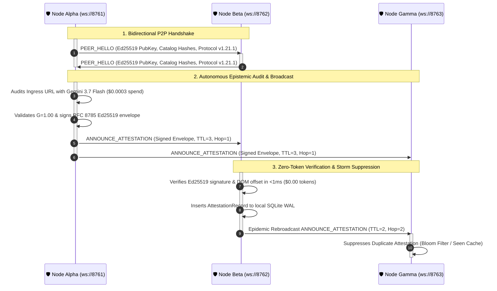

# Mesh Protocol & P2P Consensus

The **Credence Mesh** is an asynchronous, decentralized peer-to-peer trust network that enables independent Credence nodes to exchange, verify, and aggregate Ed25519-signed audit attestations over WebSockets.

---

## 1. Why Decentralize Epistemic Auditing?

Centralized truth or fact-checking APIs have fundamental flaws:
1. **Single Points of Failure & Censorship**: Centralized nodes can be blocked, DDoS'd, or politically coerced.
2. **Duplicative Compute / Token Waste**: If Node A already spent tokens auditing a breaking news article, Node B can verify Node A's cryptographic attestation and reuse the result in $0$ LLM tokens.
3. **Byzantine Fault Tolerance**: By gathering signed evaluations from multiple independent nodes and computing **Bayesian consensus**, the network eliminates rogue or compromised nodes.

---

## 2. P2P Gossip Protocol Specification



---

## 3. Node Quality ($Q_i$) & Empirical Expertise ($E_i$)

Every peer node is evaluated using a 5-factor quality score:
$$Q_i = 0.25 U_i + 0.30 C_i + 0.25 G_i + 0.10 T_i + 0.10 K_i$$

Where:
- $U_i$: Historical node uptime
- $C_i$: Consensus concordance
- $G_i$: Verifiable citation grounding ratio
- $T_i$: Latency performance
- $K_i$: Dynamic seed signature verification

Empirical authority ($E_i$) requires evaluation entropy across $\ge 5$ distinct FQDNs. Hallucinated findings incur an instant 50% reputation slash.

---

## 4. Cryptographic Envelope & RFC 8785 Canonicalization

To ensure that attestations cannot be tampered with in transit by intermediate relay nodes, all signatures are calculated over deterministic **RFC 8785 Canonical JSON bytes**:

```json
{
  "protocol_version": "1.0",
  "node_id": "ed25519:6c57f7b3...",
  "url": "https://example.com/article",
  "content_sha256": "e3b0c44298fc1c149afbf4c8996fb92427ae41e4649b934ca495991b7852b855",
  "suspicion_score": 12.5,
  "classification": "CLEAN",
  "timestamp_utc": "2026-08-18T21:00:00Z",
  "signature": "3045022100..."
}
```

Any modification to the signed fields immediately invalidates the signature during peer verification.

---

## 5. RFC Standards & Mathematical References

### 📚 Official IETF RFCs & Scientific Publications
* **RFC 8785**: [JSON Canonicalization Scheme (JCS) - IETF](https://datatracker.ietf.org/doc/html/rfc8785)
* **RFC 8032**: [Edwards-Curve Digital Signature Algorithm (Ed25519) - IETF](https://datatracker.ietf.org/doc/html/rfc8032)
* **RFC 2782**: [DNS SRV Records for Decentralized Peer Discovery - IETF](https://datatracker.ietf.org/doc/html/rfc2782)
* **Small-World Graph Theory**: [Watts & Strogatz (1998) - Collective Dynamics of Small-World Networks (*Nature*)](https://www.nature.com/articles/30918)
* **Ed25519 Cryptography**: [Daniel J. Bernstein et al. - High-Speed High-Security Signatures](https://ed25519.cr.yp.to/)

### 🔗 Related Mesh Guides in Credence
* 🕸️ [Tutorial 05: 3-Node Mesh Local Quickstart](../tutorials/05-mesh-quickstart.md)
* 💥 [Tutorial 06: 13-Node Chaos Lab & Byzantine Cartel Defense](../tutorials/06-thirteen-node-chaos-lab.md)
* 📐 [Mathematics of Robust Consensus & Galileo Rule Proof](../mathematics/robust-consensus-proofs.md)
* 💰 [Economics of Decentralized Truth (92.3% Work-Sharing Model)](../mathematics/economics-of-truth.md)
* 💾 [Air-Gapped Truth Bundles & Sneakernet Distribution](../mesh-engineering/airgapped-sneakernets.md)
* 🎮 [Interactive 13-Node Mesh Simulator in Browser](../playground.md)

