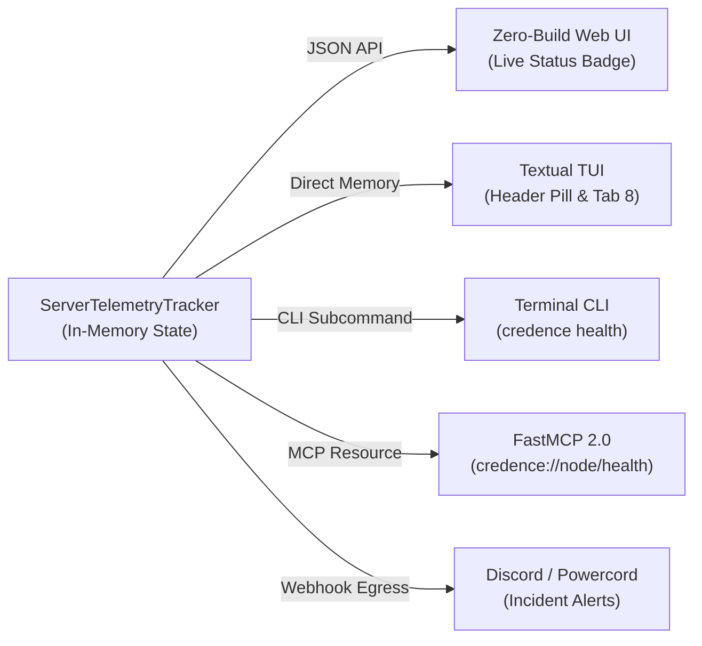

# Interface Telemetry Loopback Protocol (ITLP-v1)

## 1. Specification Overview

The **Interface Telemetry Loopback Protocol (ITLP-v1)** defines the normative data models, rolling aggregation algorithms, health assessment state transitions, and presentation interfaces that enable Credence nodes to maintain closed-loop observability across human terminals, edge workers, and autonomous AI agents.

---

## 2. Telemetry Event & Aggregation Schema

### 2.1 Rolling Window Invariant
A node MUST maintain a thread-safe, memory-bounded rolling window of recent HTTP and RPC execution events ($W = 300\text{ seconds}$). Events older than $t_{\text{now}} - W$ MUST be pruned on every ingestion and query cycle.

### 2.2 Telemetry Snapshot Payload
When queried via REST (`GET /api/health` or `GET /health`) or MCP (`credence://node/health`), the payload MUST conform to the following JSON schema:

```json
{
  "$schema": "https://json-schema.org/draft/2020-12/schema",
  "type": "object",
  "required": ["status", "service", "version", "telemetry"],
  "properties": {
    "status": { "type": "string", "enum": ["healthy", "degraded", "unhealthy"] },
    "service": { "type": "string", "const": "credence" },
    "version": { "type": "string" },
    "telemetry": {
      "type": "object",
      "required": ["uptime_seconds", "memory_mb", "request_counts", "latencies_ms", "active_alerts"],
      "properties": {
        "uptime_seconds": { "type": "integer", "minimum": 0 },
        "memory_mb": { "type": "number", "minimum": 0 },
        "request_counts": {
          "type": "object",
          "required": ["total", "2xx", "3xx", "4xx", "5xx"],
          "properties": {
            "total": { "type": "integer" },
            "2xx": { "type": "integer" },
            "3xx": { "type": "integer" },
            "4xx": { "type": "integer" },
            "5xx": { "type": "integer" }
          }
        },
        "latencies_ms": {
          "type": "object",
          "required": ["p50", "p95"],
          "properties": {
            "p50": { "type": "number" },
            "p95": { "type": "number" }
          }
        },
        "active_alerts": {
          "type": "array",
          "items": {
            "type": "object",
            "required": ["id", "severity", "title", "message"],
            "properties": {
              "id": { "type": "string" },
              "severity": { "type": "string", "enum": ["info", "warning", "critical"] },
              "title": { "type": "string" },
              "message": { "type": "string" }
            }
          }
        },
        "recent_errors": {
          "type": "array",
          "items": {
            "type": "object",
            "properties": {
              "time": { "type": "string" },
              "path": { "type": "string" },
              "status": { "type": "integer" },
              "error": { "type": ["string", "null"] }
            }
          }
        }
      }
    }
  }
}
```

---

## 3. Node State Machine & Alert Severity

A node evaluates its overall health status according to deterministic mathematical thresholds:

| Condition | Metric Evaluated | Trigger Threshold | Resulting Node Status | Alert Severity |
| :--- | :--- | :--- | :--- | :--- |
| **Normal Operations** | $N_{5xx} = 0 \land M \le 850\text{ MB}$ | Baseline | `healthy` | None |
| **Occasional Errors** | $1 \le N_{5xx} < 5$ | Low Error Count | `healthy` (with notice) | `warning` |
| **5xx Spike** | $N_{5xx} \ge 5$ in $W=300\text{s}$ | Elevated Server Errors | `degraded` | `critical` |
| **Memory Pressure** | $M > 850.0\text{ MB}$ | High Container RSS | `degraded` | `warning` |
| **Service Unreachable**| Uptime Check Probe Failed | Fraction True $< 1.0$ | `unhealthy` | `critical` |

---

## 4. Multi-Surface Integration Matrix



1. **Terminal TUI**: Queries in-process `global_telemetry` on a 3.0-second interval, reactively updating the `#header_status_pill` and `#ops_panel` without network overhead.
2. **FastMCP 2.0 Server**: Exposes `credence://node/health` resource and `credence_get_health_status` tool for autonomous agents.
3. **CLI Interface**: `credence health` inspects a local running daemon or remote URL and prints human-readable Rich status panels.
4. **Cloud Monitoring & Discord**: Terraform pipelines forward critical incidents to Discord webhooks (`discord_webhook_url`).
