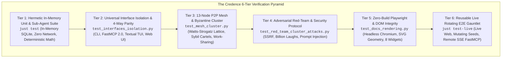
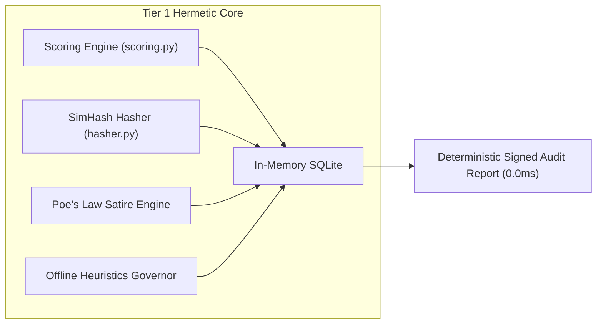
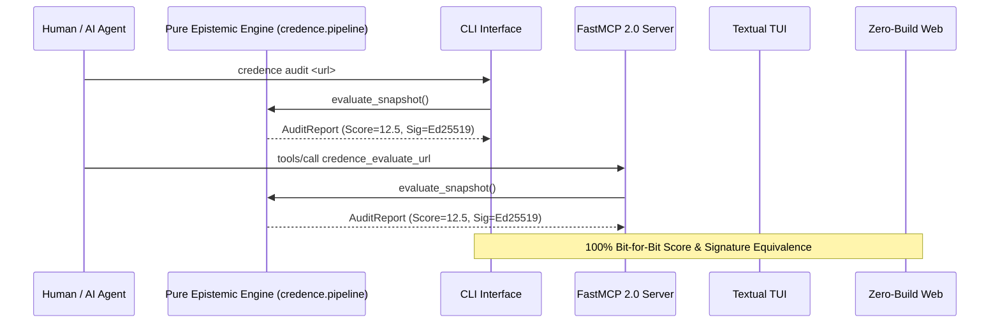
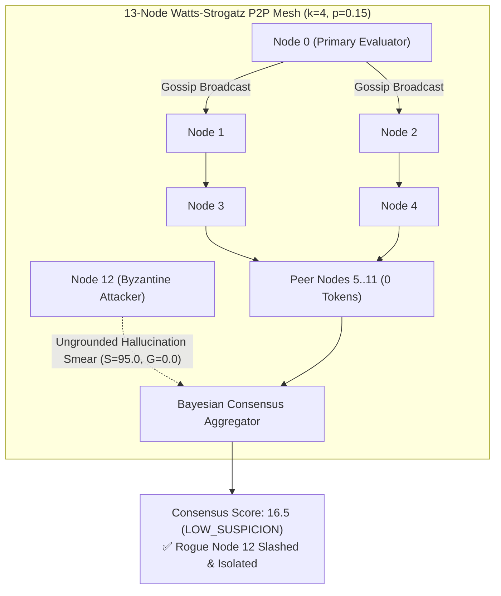
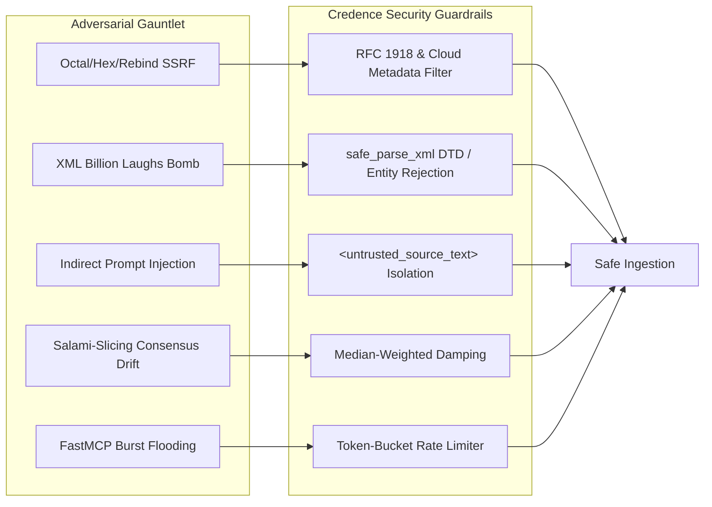
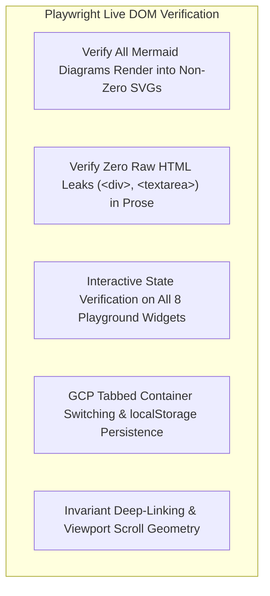
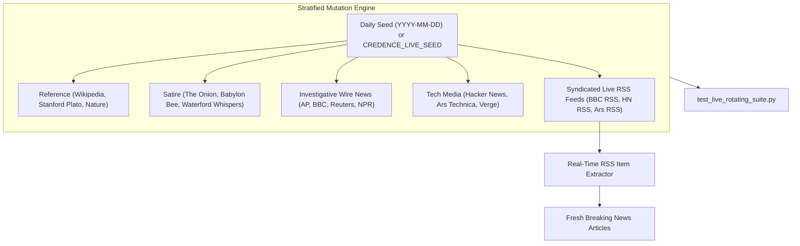

# 6-Tier Multi-Layered Testing Strategy

Credence is designed for mission-critical epistemic evaluation, autonomous agent governance, and decentralized trust. Because autonomous agents and human analysts rely on Credence to detect disinformation, manipulative patterns, and synthetic slop, the codebase enforces a rigorous **6-Tier Multi-Layered Testing Architecture**.



---

## 1. The 6 Testing Tiers & Why Each Matters

| Tier | Focus Area | Primary Command | Network Required? | Latency | Why It Is Vital |
| :--- | :--- | :--- | :--- | :--- | :--- |
| **Tier 1** | **Hermetic Unit & Math** | `just test` | ❌ No (100% Offline) | `<65s` | Guarantees deterministic scoring math, SimHash hashing, and offline heuristics with $0.00$ token cost. |
| **Tier 2** | **4-Way Interface Parity** | `pytest tests/test_interfaces_isolation.py` | ❌ No | `<3s` | Guarantees zero business logic leakage across CLI, FastMCP 2.0, Textual TUI, and Web. |
| **Tier 3** | **P2P Mesh & Byzantine Cluster** | `pytest tests/test_mesh_cluster.py` | ❌ No (Local Sockets) | `<25s` | Validates BitTorrent work-sharing (92.3% compute savings) and Byzantine cartel slashing ($3f+1$). |
| **Tier 4** | **Adversarial Red-Team** | `pytest tests/test_red_team_cluster_attacks.py` | ❌ No (Hermetic Fixtures) | `<5s` | Protects ingestion engines against SSRF, XML entity expansion bombs, and prompt injections. |
| **Tier 5** | **Zero-Build Playwright** | `pytest tests/test_docs_rendering.py` | ❌ No (Local HTTP) | `<20s` | Verifies live SVG diagram dimensions, widget state transitions, and zero npm supply-chain dependencies. |
| **Tier 6** | **Live Rotating E2E Suite** | `just test-live` | 🌐 Yes (Live Public Web) | `<30s` | Validates live RSS syndication, dynamic article extraction, remote FastMCP 2.0 SSE, and live web drift. |

---

## 2. Tier 1: Hermetic In-Memory Unit & Math Suite

### Objective & Methodology
Tier 1 is the foundational bedrock of Credence. In accordance with **[Invariant 4: Hermetic Testing](../invariants.md#invariant-4)**, Tier 1 runs 100% network-free using in-memory SQLite databases (`sqlite+aiosqlite:///:memory:`), mock HTML fixtures, and deterministic taxonomy catalogs.



### Key Properties Tested
1. **Mathematical Scoring Bounds**: Verifies that Suspicion Scores strictly adhere to the range $[0.0, 100.0]$ and Suspicion Density $D = \frac{100 \times S}{\text{word\_count}}$ computes accurately.
2. **Poe's Law & Satire Neutralization**: Ensures legitimate satire publications (e.g. The Onion, Babylon Bee) receive score $0.00$ (`SATIRE_PARODY`), while bad-faith factual defamation triggers `SPJ-1.6` cloaking overrides.
3. **SimHash 64-Bit Hamming Distance**: Verifies that near-duplicate and mirrored articles yield Hamming distances $d_H \le 3$, while unrelated articles yield $d_H > 15$.
4. **Token Headroom & Offline Circuit Breakers**: Validates that when token limits or offline flags activate, the engine seamlessly switches to `evaluation_method: "offline_structural_heuristic"` with confidence capped at $\le 0.50$.

> [!TIP]
> Run Tier 1 locally during development with `just test`. It executes over 150 tests in under 65 seconds with zero network access and zero token expenditure.

---

## 3. Tier 2: Universal Interface Isolation & 4-Way Parity

### Objective & Methodology
Credence is built on the principle of **Universal Presentation Layer Parity** (**[Invariant 26](../invariants.md#invariant-26)**). All capabilities must be symmetrically accessible through all four primary interfaces:
1. **CLI Workstation**: `credence audit`, `credence lookup`, `credence export-report`, `credence verify-file`.
2. **FastMCP 2.0 Agent Server**: `credence_` JSON-RPC tools and `credence://` state resources over stdio/SSE.
3. **Textual Terminal Workstation (TUI)**: Interactive keyboard-driven desktop workspace (`credence tui`).
4. **Zero-Build Web UI**: Sovereign client-side visual explorer (`web/`).



### Why Interface Isolation Matters
By decoupling business logic from presentation adapters, core algorithms can be updated and audited independently. Tier 2 tests verify that calling `evaluate_snapshot()` directly returns the exact same mathematical score, classification band, and RFC 8785 Ed25519 envelope as invoking it through the CLI or FastMCP 2.0 JSON-RPC.

---

## 4. Tier 3: 13-Node P2P Mesh Cluster & Byzantine Defense

### Objective & Methodology
Credence Mesh allows nodes to gossip signed RFC 8785 envelopes, share computational workload, and achieve distributed consensus. Tier 3 tests deploy a 13-node **Watts-Strogatz Small-World Lattice** ($N=13, k=4, p=0.15$) on ephemeral local WebSocket ports to stress-test decentralized operations.



### Key Properties Tested
1. **BitTorrent Work-Sharing Compute Savings**: Node 0 evaluates breaking news with Gemini 3.7 Flash; peer nodes 1..12 adopt the signed attestation in $0$ LLM tokens, achieving **92.3% compute savings** at $\$0.00$ marginal cost.
2. **Gossip Epidemic Diffusion & Storm Suppression**: Verifies that attestations propagate across all 13 nodes in $<0.6\text{s}$ while LRU deduplicators prevent message storm loops.
3. **Byzantine Sybil Cartel Resistance ($3f+1$)**: Injects malicious rogue nodes submitting ungrounded hallucinated smear attacks ($S=95.0, G=0.0$). The Bayesian Consensus Aggregator detects $G < 0.80$, enforces **[Invariant 23: The Galileo Rule](../invariants.md#invariant-23)**, and slashes the rogue node from consensus.

---

## 5. Tier 4: Adversarial Red-Team & Protocol Defense

### Objective & Methodology
Ingesting untrusted web content exposes agent nodes to malicious payloads, memory exhaustion, and prompt injections. Tier 4 executes an automated security gauntlet against all ingestion layers.



### Key Attacks Neutralized
* **SSRF Attacks**: Rejects cloud metadata endpoints (`169.254.169.254`, `metadata.google.internal`), octal IP encodings (`0177.0.0.1`), and loopback subnets.
* **Billion Laughs XML Expansion**: Enforces strict parsing rejecting `<!DOCTYPE` and `<!ENTITY>` declarations in RSS/Atom feeds.
* **Indirect Prompt Injections**: Encloses all external webpage text in `<untrusted_source_text>` isolation tags, neutralizing prompt overrides attempting to hijack evaluator instructions.

---

## 6. Tier 5: Zero-Build Playwright & DOM Integrity

### Objective & Methodology
In accordance with **[Invariant 31: Universal Zero-Build Standards](../invariants.md#invariant-31)**, Credence uses zero npm dependencies. Tier 5 uses async Playwright and headless Chromium to verify that vanilla ES Modules and CSS Custom Properties render accurately across all viewports.



### Tested Contracts
* **Mermaid SVG Rendering**: Asserts all diagram blocks render into SVGs with bounding box `width > 50px` and `height > 30px`.
* **Playground Widget Interactivity**: Tests live DOM state transitions across all 8 interactive widgets (Mesh Simulator, SimHash Calculator, Verbatim Grounding Tester, WebCrypto Verifier, etc.).
* **Zero Console Errors**: Traps and fails on any browser `console.error` or unhandled JavaScript exceptions during navigation.

---

## 7. Tier 6: Reusable Live Rotating & Mutating E2E Gauntlet

### Objective & Methodology
Tier 6 verifies that Credence works in real-world conditions against the live public web. Rather than relying on static fixtures, Tier 6 implements a **Stratified Master Corpus** and **Deterministic Rotation Engine** ([`tests/e2e/live_corpus.py`](https://github.com/artibyrd/credence/blob/main/tests/e2e/live_corpus.py)).



### Why Live Rotating Testing is Vital
1. **Immunity to Test Overfitting**: Rotating targets daily ensures the evaluation engine does not overfit to specific DOM layouts or static HTML fixtures.
2. **Real-Time Live Article Discovery**: Dynamically extracts fresh breaking news links directly from live RSS feeds and audits them immediately, exercising real-time ingestion on articles published minutes prior.
3. **Live Remote FastMCP 2.0 SSE Transport**: Verifies remote SSE stream establishment, tool listing, and consensus querying against production endpoints (`https://mcp.credence.run/sse`).
4. **Live Cryptographic Verification**: Generates signed RFC 8785 JSON attestations from live web snapshots and cryptographically validates the Ed25519 signatures.

---

## 8. Operational Task Commands & Test Runner Guide

```bash
# 1. Run standard hermetic unit test suite (<65s)
just test

# 2. Run reusable live rotating E2E gauntlet with default daily seed
just test-live

# 3. Run live rotating E2E suite with a custom pseudo-random seed
CREDENCE_LIVE_SEED=seed_gamma_2026 just test-live

# 4. Run all live E2E tests (rotating suite, domains, remote MCP, mesh)
just test-e2e

# 5. Run Playwright zero-build documentation rendering verification
poetry run pytest tests/test_docs_rendering.py -v -m e2e

# 6. Run full static linting and type checking (Ruff + Mypy)
just lint
```
