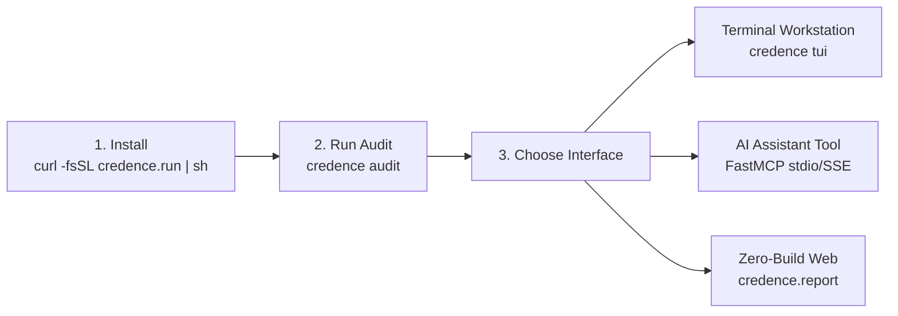

# Quickstart & Installation

Get started with the Credence CLI, FastMCP 2.0 server, and Textual TUI workstation in minutes.



### Operational Cost Profiles

| Profile | Target Latency | Thinking Tokens | Cost per 1k Audits | Best For |
| :--- | :--- | :--- | :--- | :--- |
| **`FREE`** | < 0.1s | 0 tokens (Offline) | **$0.00** | Hermetic CI/CD, offline air-gap |
| **`BALANCED`** | 2.4s – 3.8s | 1,024 – 4,096 tokens | **$0.34 – $0.68** | Daily news, RSS sifter (Default) |
| **`ULTRA`** | 5.0s – 8.0s | 8,192 – 16,384 tokens | **$1.10 – $2.20** | Deep investigative 10-K & legal filings |

> [!TIP]
> **Token Headroom Safety**: Credence includes an automatic circuit breaker that falls back to 100% offline structural heuristics whenever your API budget reaches 30% remaining headroom.

---

## 1. Quick Installation

:::tabs
=== POSIX One-Liner (macOS & Linux)
```bash
curl -fsSL https://credence.run/install.sh | bash
```

=== Git Clone & Poetry
```bash
git clone https://github.com/artibyrd/credence.git
cd credence
poetry install
```

=== Docker Container
```bash
docker run -d -p 8000:8000 -p 8765:8765 ghcr.io/artibyrd/credence:latest
```
:::

---

## 2. API Key Configuration

Credence uses **Gemini 3.7 Flash** for its multi-agent evaluation pipeline. Set your API key in your shell environment:

```bash
export CREDENCE_GEMINI_API_KEY="your-gemini-api-key"
```

> **Note**: Credence includes a built-in **Token Safety Governor** that defaults to offline structural heuristic fallback if no API key is provided or when budget limits are exceeded.

---

## 3. Instant Node Germination (Rapid "Miracle-Gro" Bootstrap)

Instead of starting with an empty database and zero mesh activity, run `credence germinate` to ignite your node in under 5 seconds:

```bash
# Rapid node germination: identity genesis, 0-token mesh inoculation, 24 preset feeds, initial burst
credence germinate

# Or using standard workspace recipe:
just germinate
```

This single zero-friction command:
1. 🔑 **Epistemic Genesis**: Generates and registers your local cryptographic Ed25519 node keypair.
2. 💧 **Peer Mesh Inoculation**: Fetches verified peer attestations from Genesis seeds (`seeds.credence.nexus`) at **$0.00 token cost**.
3. 🌱 **Soil Preparation**: Sows 24 preset categorized feed subscriptions across 4 tiers with Rendezvous hashing affinity.
4. ⚡ **Miracle-Gro Burst**: Audits top novel articles and produces signed local attestations.
5. 📦 **Web Hydration**: Syncs `reports.json` so the local Zero-Build Web UI (`just serve-web`) is immediately hot and responsive.

---

## 4. Running Your First Audit

Audit any URL directly from your terminal:

```bash
# Basic audit with default Balanced profile (1,024 thinking tokens)
credence audit https://example.com/news-story

# Free tier audit (0 thinking tokens, fast & low cost)
credence audit https://example.com/news-story --profile free

# Ultra depth audit (8,192 thinking tokens)
credence audit https://example.com/news-story --profile ultra
```

Example terminal output:
```text
🛡️ Credence Audit: https://example.com/breaking-news
Content SHA-256: 8f4e2b...
Classification: FACTUAL_REPORTING (is_satire: False)
Suspicion Score: 0.12 (Low Suspicion)
Violations Found: 1
  - [IEP:INFORMAL/straw_man@1.0.0] Severity: 2
    Quote: "Opponents believe that everyone should lose their jobs immediately."
    Grounding: Verified (G = 1.00)
Attestation Signed: Ed25519 (Node ID: e4d9...)
```

---

## 5. Launching the Textual TUI

Launch the full-screen terminal workstation with live mesh node monitors, audit history, and real-time epidemic gossip visualizations:

```bash
credence tui
```

---

## 6. FastMCP 2.0 Integration

### Claude Desktop Configuration

Add Credence to your `claude_desktop_config.json`:

```json
{
  "mcpServers": {
    "credence": {
      "command": "credence",
      "args": ["mcp", "stdio"],
      "env": {
        "CREDENCE_GEMINI_API_KEY": "your-gemini-api-key"
      }
    }
  }
}
```

### FastMCP SSE Server

Start the standalone SSE server for remote AI agents and browser clients:

```bash
credence serve --transport sse --port 8000
```
Connect via `http://localhost:8000/sse`.

---

## 6. Verification Suite

Run the hermetic test suite to verify your local installation:

```bash
just test
```
All 144 unit and mesh tests execute hermetically in under 65 seconds with zero external network dependencies.
