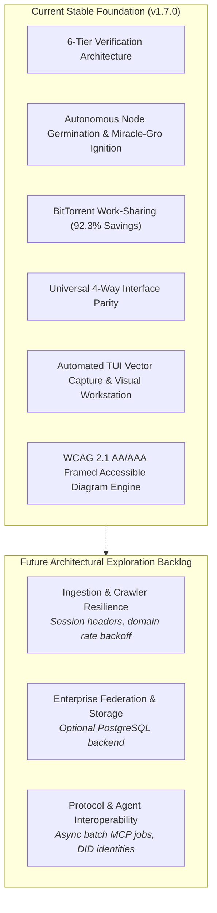

# Ecosystem Roadmap & Known Issues Backlog

This document serves as the **sovereign, in-repository source of truth** for tracked architectural evolution, observed real-world edge cases, and potential future enhancements across the Credence ecosystem. By maintaining this in pure Markdown rather than external issue trackers, autonomous AI agents and human developers can intuitively discover known system characteristics directly within their local workspace context.

---

## 1. Known Edge Cases & Operational Mitigations

The following items are real-world edge cases observed during live testing, along with their current tactical mitigations and potential future resolutions:

### A. Bot-Wall Interstitials on Protected Domains
* **Observation**: Aggressive bot-protection services (e.g. Cloudflare Turnstile / Akamai Bot Manager) may serve a challenge interstitial page (*"Checking your browser..."*) to automated headless browsers.
* **Current Mitigation**: The live test gauntlet (`test_live_rotating_suite.py`) inspects extracted DOM text and gracefully skips satire/semantic assertions on interstitial challenge pages.
* **Future Enhancement**: Add an optional CLI flag (`credence audit <url> --session-cookie <cookie>` or `--browser-profile <path>`) allowing human analysts to pass authenticated session headers when auditing protected or paywalled resources.

### B. SQLite Connection Pool Cleanup under Rapid Test Iterations
* **Observation**: Under extremely rapid sequential async test teardowns across different event loops, SQLAlchemy's garbage collector may emit connection cleanup warnings.
* **Current Mitigation**: `credence/db.py` uses `NullPool` and active event loop binding to ensure no closed-loop errors or test failures occur.
* **Future Enhancement**: For high-concurrency multi-tenant enterprise federations (`credence init-org`), provide an optional PostgreSQL/Postgres-async connection backend alongside the default zero-config SQLite WAL engine.

### C. Proxy Timeout Margins for Deep-Thinking Multi-Article Batches
* **Observation**: Remote FastMCP 2.0 cached lookups execute in `<100ms`, but an uncached cold audit with 4,096 thinking tokens takes 3–5 seconds. A batch request of 10+ URLs over a single JSON-RPC call could approach Cloudflare Worker 30s CPU limits.
* **Current Mitigation**: FastMCP server processes single-URL requests with sub-5s latency. Feed Sifter runs background pre-warming for syndicated feeds.
* **Future Enhancement**: Introduce an asynchronous FastMCP batch job token pattern (`credence_batch_audit_start` returning a `job_id` with progressive SSE status events).

### D. Non-Standard Syndicated RSS DateTime Formats
* **Observation**: Niche RSS feeds occasionally publish non-standard date strings (epoch integers, missing timezone offsets, or unusual date delimiters).
* **Current Mitigation**: `credence/feeds/parser.py` implements a 4-tier flexible date parser (RFC 822 $\to$ ISO 8601 $\to$ format permutations $\to$ epoch timestamp fallback).

---

## 2. Future Enhancement Backlog (Thematic Focus Areas)

Rather than committing to rigid version numbers, candidate enhancements are organized by thematic domain to be prioritized based on real-world adoption:

### Ingestion & Crawler Resilience
- **CLI Authenticated Scraping**: Optional `--session-cookie`, `--browser-profile`, or custom headers for auditing behind paywalls and subscriber portals.
- **Adaptive Domain Rate Limits**: Per-domain request tracking and jittered backoff to prevent HTTP 429 rejections during high-frequency feed sifting.
- **Extended Syndication Formats**: Support for JSONFeed v1.1 and enriched multimedia podcast enclosure metadata.

### Enterprise Federation & Scale
- **Optional PostgreSQL Backend**: Pluggable `CREDENCE_DATABASE_URL=postgresql+asyncpg://...` support in `credence/db.py` for distributed multi-tenant federations (`credence init-org`).
- **Dynamic Organization Peer Discovery**: DNS-SRV record resolution (`_credence._tcp.domain.org`) for zero-config mesh clustering across corporate networks.
- **Client-Side Cryptographic Audit Certificates**: Zero-npm printable/exportable audit reports for legal and journalistic disclosure.

### Protocol & Agent Interoperability
- **Asynchronous FastMCP Batch Queue**: Streaming job progress and partial result updates over Server-Sent Events (SSE).
- **W3C Decentralized Identifier (DID) Integration**: Mapping Ed25519 node identities to `did:key` and `did:web` standard formats.
- **WebAssembly In-Browser Evaluator**: 100% client-side structural heuristic evaluation running inside Web Workers for zero-server deployments.

---

## 3. Guiding Invariants for Roadmap Contributions

When implementing items from this backlog, all contributors and autonomous agents must preserve:
1. **[Invariant 31: Zero-npm Standard](invariants.md#invariant-31)**: Never introduce Node.js or npm dependencies into web portals or documentation.
2. **[Invariant 4: Hermetic Testing](invariants.md#invariant-4)**: Default test suites must run 100% offline in-memory.
3. **[Invariant 26: Universal Feature Parity](invariants.md#invariant-26)**: New capabilities must be exposed symmetrically across CLI, FastMCP 2.0, Textual TUI, and Web.
