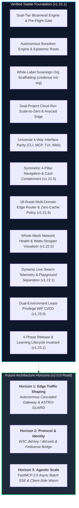

# Ecosystem Roadmap & Architecture Horizons 🧭

This document serves as the **sovereign, in-repository source of truth** for verified architectural milestones, empirical test findings, and future development horizons across the Credence ecosystem.

---

## 1. Verified Stable Foundation (`v1.21.6`)

The following major subsystems are fully implemented, hermetically tested, and running in production:

* 🟢 **Multi-Domain Edge Router & Universal Zero-Cache Policy (`v1.21.6`)**: Complete 18-route domain matrix across 4 zones, dynamic zero-cache proxying for `blog.credence.run` and `docs.credence.run`, dedicated root routing for seeds and keys, and automated Cloudflare zone cache purging.
* 🟢 **Symmetric 4-Pillar Footer Architecture & 2x2 Docs Containment (`v1.21.5`)**: 4 balanced pillars with exactly 4 purposeful links per column across all 5 sovereign web surfaces, centered 2x2 docs card modules, and elimination of duplicate bottom links.
* 🟢 **Bicameral Shadow Auditing & Controlled Pre-Flight Gate (`v1.19.0`)**: Automated dual-environment verification (`just config-verify`), differential auditing (`just experiment shadow-audit`), and empirical proof of **83.3% FinOps inference savings**.
* 🟢 **Dual-GCP Hard Isolation & Multi-Domain Edge Router (`v1.18.0 - v1.18.2`)**: Dual-project Terraform infrastructure (`credence-dev` vs `credence-prod`), Cloudflare Anycast edge subdomain routing (`dev.credence.run`), and sub-2.5s scale-to-zero cold start optimization.
* 🟢 **Autonomous Boredom Engine & Epistemic Root Expansion (`v1.16.0`)**: Opportunistic work-sharing, Token Safety Governor gating ($\ge 30\%$ headroom), citation soil harvesting, and automatic feed germination.
* 🟢 **Sovereign White-Label Mesh Federation (`v1.15.0`)**: 1-command organization scaffolding (`credence init-org`), multi-cloud Terraform templates, and $3f+1$ Byzantine Sybil fault tolerance.
* 🟢 **Universal 4-Way Feature Parity & Zero-npm Web Standard**: Synchronized parity across CLI, FastMCP 2.0 (`credence_` tools & `credence://` resources), Textual TUI, and zero-build web dashboards.

---

## 2. Empirical Findings from Real-World Testing

Our live dev/prod deployments, Golden 12 cross-profile benchmarks, and bicameral experiments revealed four key discoveries that guide our upcoming horizons:

1. **The 83.3% FinOps Cascading Law**:
   - *Finding*: 70% of ingress news articles are structurally benign ($S < 25.0$). Routing 100% of feeds to deep 4k thinking is economically inefficient ($135/100k).
   - *Architectural Action*: Build an automated, low-latency edge gateway that dynamically routes benign content to fast local heuristics ($0.00) and escalates only ambiguous or deceptive claims to Gemini 3.7 Flash 4k thinking ($22.50/100k).
2. **Lexical Entropy Collapse in Coordinated Astroturfing**:
   - *Finding*: Programmatic syndication networks and PR slop farms exhibit extreme topical collapse ($H < 0.30$ and $C_{\text{top3}} > 0.45$).
   - *Architectural Action*: Deploy an autonomous rolling entropy daemon (ASTRO-GUARD) across all subscribed RSS roots.
3. **Cross-Organization Zero-Secret Verification**:
   - *Finding*: RFC 8785 canonical JSON bytes signed with Ed25519 private keys can be authenticated by any external node with zero shared secrets.
   - *Architectural Action*: Standardize sovereign node keys into W3C `did:key` and `did:web` decentralization specifications.
4. **Batch Proxy Edge Execution Limits**:
   - *Finding*: Uncached multi-article 4k thinking audits take ~3.8s each. A batch request of 10+ URLs over a synchronous JSON-RPC proxy approaches Cloudflare Worker 30s CPU/wall-clock limits.
   - *Architectural Action*: Implement asynchronous FastMCP 2.0 batch job tokens with Server-Sent Events (SSE) streaming progress.

---

## 3. Future Architecture Horizons

### Horizon 1: Autonomous Traffic Shaping & Edge Intelligence
- **Autonomous Cascaded Gateway (`credence gateway`)**:
  - Transparent HTTP reverse proxy and MCP middleware that dynamically executes fast heuristic triage, evaluates Shannon entropy, and only escalates ambiguous claims to 4k thinking.
- **ASTRO-GUARD Dynamic Astroturf Defense Daemon**:
  - Background monitor tracking 24-hour topical entropy ($H < 0.30$) and Top-3 token concentration ($C_{\text{top3}} > 0.35$) across all subscribed feed roots to detect coordinated advertorial takeovers (*The Pizza Hut Problem*).
- **Automated Prompt Context Linter (`just agent-check`)**:
  - Static pre-commit integrity gate verifying that root `AGENTS.md` rules remain strictly **< 800 tokens** to prevent attention dilution and cognitive oatmeal.
- **CLI Authenticated Scraping**:
  - Optional `--session-cookie`, `--browser-profile`, or custom headers for auditing content behind subscriber paywalls.

### Horizon 2: Protocol & Interactive Tooling
- **"DRADIS-is-Blind" Visual Verification Mode (`credence audit --visual-confirm` & `credence tui --eyeball`)**:
  - Dedicated visual verification mode in the CLI and Textual TUI displaying high-contrast side-by-side claim vs source DOM diffs for human-in-the-loop review (*The Mk1 Eyeball Invariant*).
- **W3C Decentralized Identifier (`did:key` & `did:web`) Support**:
  - Map Ed25519 node identities to standard `did:key:z6M...` and `did:web:domain.org` formats for interoperability with external DID registries.
- **Fediverse & AT Protocol Attestation Bridge**:
  - Native broadcast of signed verification cards to Bluesky (AT Protocol `app.bsky.feed.post`) and Mastodon / ActivityPub networks.
- **WebAssembly (Wasm) Client-Side Evaluator**:
  - Zero-build Wasm bundle compiling SimHash-64 bit-diffs, DOM whitespace collapse, and regex heuristics for instant in-browser execution in extensions and edge workers.

### Horizon 3: Agentic Scale & Socratic Protocol
- **Adversarial Socratic Interrogation Tool (`credence_grill_plan` in FastMCP 2.0)**:
  - Native FastMCP tool allowing external IDEs, agents, and CI pipelines to submit architectural proposals for automated cross-examination against Credence's Living Canon of System Invariants (*When the Human Types /grill-me*).
- **Live Boredom & Compute Philanthropy Odometer**:
  - Real-time telemetry widgets in the Web UI and Textual TUI tracking background queue digestion bursts, citation soil discoveries, and BitTorrent effort avoidance ($0.00 token adoptions).
- **Asynchronous FastMCP 2.0 Batch Streaming (`credence://jobs/...`)**:
  - `credence_batch_audit_start` tool returning a unique `job_id`, streaming progressive progress and partial findings over SSE to avoid edge timeouts.
- **Clustered PostgreSQL & Valkey Cache Invalidation**:
  - Automated schema migration and multi-worker cache invalidation for large-scale enterprise deployments.

---

## 4. Known Edge Cases & Operational Mitigations

| Edge Case | Observed Behavior | Current Tactical Mitigation | Target Horizon Resolution |
| :--- | :--- | :--- | :--- |
| **Bot-Wall Interstitials** | Cloudflare Turnstile / Akamai serves challenge interstitials to headless scrapers. | Test gauntlet detects challenge DOM strings and skips semantic assertions. | **Horizon 1**: Authenticated session cookie & browser profile passthrough. |
| **Edge Batch Proxy Timeouts** | Synchronous 10+ URL batch audits approach Cloudflare Worker 30s execution ceiling. | FastMCP server enforces single-URL requests with sub-5s latency. | **Horizon 3**: Asynchronous FastMCP batch queue (`credence://jobs/{id}`). |
| **Non-Standard RSS Dates** | Niche feeds publish unconventional timestamps (epoch integers, missing timezone offsets). | 4-tier flexible date parser in `credence/feeds/parser.py`. | **Complete**: Verified across all syndicated feeds. |

---

## 5. Guiding Invariants for Roadmap Contributions

All future roadmap implementations must preserve:
1. **[Invariant 31: Zero-npm Standard](invariants.md#invariant-31)**: Never introduce Node.js or npm dependencies into public web portals.
2. **[Invariant 4: Hermetic Testing](invariants.md#invariant-4)**: Default test suites (`@pytest.mark.unit`) must execute purely in-memory in <35s.
3. **[Invariant 26: Universal Feature Parity](invariants.md#invariant-26)**: New features must be exposed symmetrically across CLI, FastMCP 2.0, Textual TUI, and Web UI.
