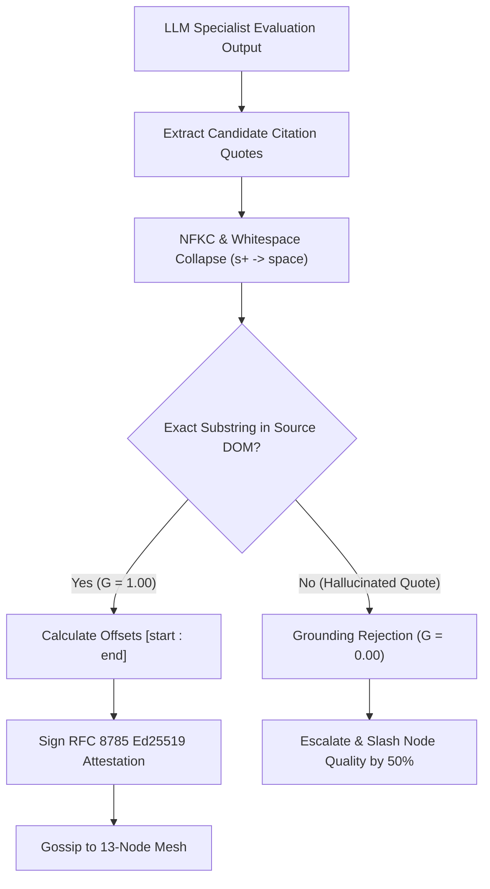

# Verbatim Grounding Mechanics & Slashing

The fundamental vulnerability of LLM-based evaluation is **hallucination**: models frequently fabricate plausible-sounding quotes or misattribute statements to justify findings.

In Credence, an evaluation that cannot cite exact, verifiable substrings from the source document is mathematically invalid ($G < 1.0$).

### Grounding Precision & Reputation Matrix

| Grounding Precision ($G_i$) | Attestation Status | Consensus Action | Reputation Impact |
| :--- | :--- | :--- | :--- |
| **$G = 1.00$** | ✅ **VERIFIED** | Admitted to Weighted Median & Galileo Pool | $+0.05$ Key Stability & Node Quality |
| **$0.75 \le G < 1.00$** | ⚠️ **PROBATION** | Local Warning, Secondary Specialist Audit | No penalty, marked for review |
| **$G < 0.75$** | ❌ **HALLUCINATED** | **Immediate Rejection** from Consensus | **50% Slashing Penalty ($W_i \leftarrow 0.5 W_i$)** |

---

## 1. The Grounding Precision Metric ($G_i$)

For any specialist audit reporting $K$ itemized rule violations $\{v_1, v_2, \dots, v_K\}$:

$$G_i = \frac{\sum_{k=1}^K \mathbb{I}(\text{quote}_k \in \text{DOM}_{\text{clean}})}{K}$$

Where:
- $\mathbb{I}(\cdot) \in \{0, 1\}$ is an exact substring indicator.
- $\text{DOM}_{\text{clean}}$ is the NFKC-normalized, whitespace-collapsed source prose.

---

## 2. Whitespace-Insensitive Character Indexing (Invariant 24)

Web typography often contains inconsistent linebreaks, non-breaking spaces (`&nbsp;`), and variable indentation.

To ensure robust matching without fuzzy string degradation:
1. **Collapsing**: All contiguous whitespace sequences in both the candidate citation and the source DOM are collapsed to a single ASCII space (`0x20`):
   $$\text{normalize}(S) = \text{re.sub}(r'\backslash s+', '\ ', \text{unicodedata.normalize}('NFKC', S)).\text{strip}()$$
2. **Exact Matching**: The validator executes exact case-sensitive substring location.
3. **Offset Calculation**: If matched, character start/end index offsets (`start_char`, `end_char`) are recorded in the attestation payload.

---

## 3. The 50% Hallucination Slash (Invariant 17)

If a node submits a single audit finding with a fabricated quote where $G_i < 0.75$:

1. **Gate Rejection**: The finding is rejected by the local quality gate and never admitted into consensus.
2. **Escalation**: Local evaluator nodes trigger a high-thinking re-evaluation with Gemini 3.7 Flash.
3. **P2P Gossip Slashing**: Peer nodes tracking evaluator reputation slash that node's historical authority score ($W_i$) by **50% across all domains**.
