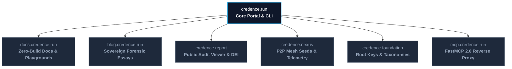

# Ecosystem Master Sitemap 🗺️

Welcome to the complete structural directory of the **Credence Epistemic Network**. Whether you are exploring decentralized P2P consensus, testing in-browser WebCrypto playgrounds, reading forensic investigative journalism, or auditing live RSS feeds, this sitemap provides instant navigation across every domain, guide, and protocol.

:::tabs
=== 🌐 Sovereign Ecosystem Domains
| Domain / Gateway | Role & Capabilities | Primary Endpoint |
| :--- | :--- | :--- |
| **`credence.run`** | Primary Network Portal, CLI Engine & Quickstart Hub | [https://credence.run](https://credence.run) |
| **`docs.credence.run`** | 100% Zero-Build Documentation, Guides & 12 Playgrounds | [https://docs.credence.run](https://docs.credence.run) |
| **`blog.credence.run`** | Sovereign Editorial, Forensic Audits & Engineering Essays | [https://blog.credence.run](https://blog.credence.run) |
| **`credence.report`** | Public Epistemic Report Viewer & Global Domain DEI Index | [https://credence.report](https://credence.report) |
| **`credence.nexus`** | Decentralized P2P Mesh Seeds, Telemetry & Node Leaderboards | [https://credence.nexus](https://credence.nexus) |
| **`credence.foundation`** | Cryptographic Root Key Custody (`root.pub`) & Taxonomy Registries | [https://credence.foundation](https://credence.foundation) |
| **`mcp.credence.run`** | FastMCP 2.0 Live Reverse Proxy (HTTP/SSE & Dynamic Tools) | `https://mcp.credence.run/sse` |
:::

---

## 1. 🛡️ Sovereign Domains & Web Surfaces

- **[https://credence.run](https://credence.run)**: Core landing page, single-command installation (`curl -fsSL https://credence.run/install.sh | bash`), terminal quickstart, and feature overview.
- **[https://credence.report](https://credence.report)**: Public report search by content SHA-256 or URL, live DEI rankings, and curated scenario benchmarks.
  - **[Interactive Report Viewer](https://credence.report/viewer.html)**: Multi-display mode audit viewer (Human Executive Briefing, Compact Density, Machine RFC 8785 JSON/ClaimReview).
- **[https://credence.nexus](https://credence.nexus)**: Decentralized gossip seed directory (`peers.json`), live 5-factor quality ($Q_i$) rankings, and compute philanthropy telemetry.
  - **[Bootstrap Seeds Manifest](https://seeds.credence.nexus/peers.json)**: Canonical list of active seed nodes for zero-touch node ignition.
- **[https://credence.foundation](https://credence.foundation)**: Governance registries, YAML/JSON taxonomy schemas, and root Ed25519 public key.
  - **[Root Public Key (`root.pub`)](https://keys.credence.foundation/root.pub)**: Canonical Ed25519 key for verifying official governance catalogs.

---

## 2. 🎮 12 Zero-Build Interactive Playgrounds

All playgrounds run **100% client-side** inside your browser using W3C WebCrypto, SVG, and ES Modules with zero backend roundtrips.

* 🕹️ **[Interactive Zero-Build Playgrounds Gateway](#docs/playground)**:
  1. **13-Node Watts-Strogatz Mesh Gossip Simulator** (Real-time $O(\log N)$ epidemic diffusion and node inspector)
  2. **SimHash-64 Bitwise Visualizer & 64-Tile Differential Grid** (Hamming distance and mirror detection)
  3. **Verbatim Grounding Tester ($G=1.00$)** (DOM character-offset validation and quote substring matcher)
  4. **Calibrated Saturation Curve Plotter** (Interactive SVG exponential curve for $S = 100(1 - e^{-k V})$)
  5. **In-Browser WebCrypto Ed25519 Attestation Verifier** (RFC 8785 canonical verification and tamper detection)
  6. **Live Namespaced Taxonomy Rule Explorer** (46 authentic rules across SPJ, IEP, and Deceptive Patterns with pagination & 1-click URI copy)
  7. **Multi-Model Cost, Latency & Sovereignty Comparator** (Gemini 3.7 Flash, Claude 3.7, GPT-4o, DeepSeek-R1, and Local Ollama)
  8. **Zero-Trust Dynamic Feed Simulator** (Topic entropy astroturfing defense & Top-3 token concentration penalty)
  9. **The Galileo Rule Consensus Simulator** (Asymmetric grounded expert override vs. ungrounded Sybil cartels)
  10. **Epistemic Heuristic Text Scanner** (Instant client-side regex evaluation for clickbait, superlatives, and urgency)
  11. **Schema.org ClaimReview JSON-LD & RFC 8785 Receipt Generator** (Live formatting and auto-height export)
  12. **Token Safety Governor & 30% Headroom Breaker** (Visual spending gauge and offline structural fallback)

---

## 3. 🏛️ Core Architectural & Epistemic Invariants

Complete canonical specifications and mathematical guarantees enforced across the network.

* 📘 **[38 Core System Invariants](#docs/invariants)**:
  * **Engineering & Safety**: Decoupled Workspaces (Inv 1), Async SQLite/aiosqlite (Inv 2), Semantic Versioning (Inv 3), Hermetic Tests (Inv 4), Scoped Docs Verification (Inv 5), Human Review / Mk1 Eyeball (Inv 6), 4-Tier Knowledge Taxonomy (Inv 7), Multi-Model Sovereignty & Token Governor (Inv 8), SSRF Loopback Defense (Inv 9), Red Team Protocol Defense (Inv 10), XML Traversal Safety (Inv 11), Ground Truth Reference Engine (Inv 12), FastMCP 2.0 Security (Inv 13), Zero-Build Static Assets (Inv 14), Edge Origin Header Translation (Inv 15), Text Evaluation Parity (Inv 16), Stratified Live Web Mutation (Inv 17), Zero-Touch Germination (Inv 18), HRW Rendezvous Partitioning (Inv 19), 3-Plane Deployment (Inv 20).
  * **Epistemic Scoring**: Topic Entropy Astroturfing Defense (Inv 21), Poe's Law & Satire Safeguards (Inv 22), Order-Agnostic Metadata (Inv 23), Namespaced Fixed Taxonomies (Inv 24), Whitespace-Insensitive Grounding (Inv 25), Heuristic Disclosure (Inv 26).
  * **Cryptographic Mesh**: RFC 8785 Canonical JSON (Inv 27), Anti-Tampering Contract (Inv 28), 5-Factor Node Quality $Q_i$ (Inv 29), Empirical Expertise $E_i$ (Inv 30), The Galileo Rule (Inv 31), BitTorrent Work-Sharing (Inv 32).
  * **Presentation & Web**: 4-Way Universal Feature Parity (Inv 33), Human-First Report Inspection (Inv 34), Multi-Display Mode & Stream Discovery (Inv 35), Zero-Build Zero-npm Invariant (Inv 36), Zero-Build Inline HTML & Nested Math Integrity (Inv 37), Anti-Scrollbox & Natural Flow Presentation (Inv 38).

---

## 4. ✍️ Sovereign Editorial & Investigative Essays

Forensic investigations, economic proofs, and real-world case studies published on the sovereign blog.

* 🚀 **[From 860MB to 2MB: Engineering a Sub-40s CI/CD Pipeline](#blog/from-860mb-to-2mb-sub-40s-cicd-pipeline)** (Slashing build uploads by 99.7%, multi-core Pytest, and pipefail stream safety)
* 🏛️ **[The 3-Plane Architecture: Zero-npm Edge & Scale-to-Zero](#blog/the-three-plane-architecture)** (Decoupling Cloudflare Edge, Cloud Run Compute, and Terraform for $0.00 idle cost)
* 📰 **[Conflict of Pun-terest: Auditing InMaricopa.com](#blog/conflict-of-pun-terest)** (Forensic audit of publisher-politician conflicts, advertorial camouflage, and policy reform)
* 🍕 **[The Pizza Hut Problem](#blog/the-pizza-hut-problem)** (Topic entropy collapse, promotional pivots, and astroturfing defense)
* 🔭 **[The Galileo Rule](#blog/the-galileo-rule)** (Why asymmetric grounded evidence neutralizes massive ungrounded Sybil cartels)
* 🎓 **[The Anti-Diploma Invariant](#blog/the-anti-diploma-invariant)** (Why credentialism fails in decentralized evaluation and performance is earned)
* ⚡ **[BitTorrent for Truth](#blog/bittorrent-for-truth)** (How P2P work-sharing delivers 92.3% compute savings at $0.00 token cost)
* 🌐 **[The Domain Epistemic Index (DEI)](#blog/the-domain-epistemic-index)** (Measuring long-term journalistic integrity across global web domains)
* 🪙 **[Gamifying Truth Without the Casino](#blog/gamifying-truth-without-the-casino)** (Merit badges, philanthropy odometers, and non-financialized reputation)
* 🛑 **[Giving Claude and Cursor an Epistemic Brake](#blog/giving-claude-and-cursor-an-epistemic-brake)** (FastMCP 2.0 integration and autonomous agent halting)
* 🍓 **[Testing 13-Node Swarms on a Raspberry Pi](#blog/testing-13-node-swarms-on-a-raspberry-pi)** (Featherweight in-memory simulation of Watts-Strogatz small worlds)
* 🌱 **[Miracle-Gro for Truth Nodes](#blog/miracle-gro-for-truth-nodes)** (Autonomous node germination, Ed25519 key minting, and zero-touch ignition)
* 🔄 **[Interface Telemetry Loopback (ITLP-v1)](#blog/interface-telemetry-loopback)** (Anonymous local telemetry and usability feedback loops)
* 🤖 **[Architecting Sovereign AI with Google Antigravity](#blog/architecting-sovereign-ai-with-google-antigravity)** (Autonomous pair programming workflows and continuous invariant synthesis)
* 📶 **[Basement Ops and Discord Alerting](#blog/basement-ops-and-discord-alerting)** (Self-hosting home server nodes with real-time incident alerting)
* 💰 **[BitTorrent Economics of Fact-Checking](#blog/bittorrent-economics-of-fact-checking)** (Mathematical breakdown of syndication compute distribution)
* 🏷️ **[The Blue Checkmark is Dead](#blog/the-blue-checkmark-is-dead)** (Why cryptographic attestations replace centralized platform badges)
* 📊 **[The Pareto Frontier of Truth](#blog/the-pareto-frontier-of-truth)** (Balancing evaluation cost, latency, thinking token depth, and accuracy)
* 🔺 **[The Six-Tier Pyramid of Decentralized Truth](#blog/the-six-tier-pyramid-of-decentralized-truth)** (The complete architectural taxonomy from raw bytes to swarm consensus)

---

## 5. 📚 Documentation Modules & Reference Guides

### Quickstart & Foundations
* **[Introduction & Overview](#docs/intro)**: What is Credence, architectural pillars, and zero-trust verification.
* **[60-Second Jump-In Quickstart](#docs/quickstart)**: CLI installation, first audit, and instant terminal workflow.
* **[Universal Feature Parity Matrix](#docs/feature-parity)**: Feature synchronization across CLI, FastMCP 2.0, Textual TUI, and Web UI.
* **[Decentralized Architecture Specification](#docs/architecture)**: End-to-end multi-agent pipeline and consensus engine specs.
* **[Zero-Build Frontend Architecture](#docs/frontend-architecture)**: Vanilla HTML5, CSS Custom Properties, and W3C WebCrypto standards.
* **[Development Roadmap & Milestones](#docs/roadmap)**: Completed capabilities and upcoming releases.

### Feature Walkthroughs
* **[01. Auditing Webpages & Text](#docs/walkthroughs/01-auditing-webpages-and-text)**: How to audit URLs, plain text, and interpret itemized violation cards.
* **[02. Zero-Trust Feed Sifting](#docs/walkthroughs/02-zero-trust-feed-sifting)**: Ingesting RSS/Atom feeds, detecting topic entropy collapse, and filtering astroturfing.
* **[03. P2P Mesh Consensus & Swarms](#docs/walkthroughs/03-p2p-mesh-consensus)**: Gossip propagation, Ed25519 signature envelopes, and consensus convergence.
* **[04. Morning Epistemic Digest](#docs/walkthroughs/04-morning-digest-briefings)**: Generating 24-hour executive news briefings and markdown summaries.

### Agentic Engineering & Continuous Learning
* **[01. Antigravity Pair-Programming Paradigm](#docs/agentic/01-antigravity-pair-programming-paradigm)**: AI-assisted development with Google Antigravity SDK.
* **[02. `/learn` & Continuous Invariant Synthesis](#docs/agentic/02-continuous-learning-and-invariant-synthesis)**: Capturing lessons and synthesizing universal system invariants.
* **[03. Hermetic Testing & Zero-npm Guardrails](#docs/agentic/03-hermetic-testing-and-zero-npm-guardrails)**: Enforcing 100% offline unit suites and zero-npm web assets.
* **[04. Multi-Model Pareto & Token Governance](#docs/agentic/04-multi-model-pareto-and-token-governance)**: Managing LLM inference costs and circuit breakers.
* **[05. FastMCP Dual Transport & 4-Way Parity](#docs/agentic/05-fastmcp-dual-transport-and-four-way-parity)**: stdio and SSE transport mechanisms with synchronous UI parity.

### Hands-On Tutorials
* **[01. Clickbait Teardown](#docs/tutorials/01-clickbait-teardown)**: Step-by-step forensic analysis of sensationalist headlines and unnamed sources.
* **[02. Satire vs. Disinformation](#docs/tutorials/02-satire-vs-disinformation)**: Poe's Law, satire neutralization, and SPJ-1.6 cloaking defense overrides.
* **[03. Claude & Cursor FastMCP Integration](#docs/tutorials/03-claude-cursor-fastmcp)**: Connecting Credence tools to Claude Desktop and Cursor in 2 minutes.
* **[04. Sovereign Org Scaffolding](#docs/tutorials/04-sovereign-org-scaffolding)**: Creating custom white-label federation organizations with `credence init-org`.
* **[05. 3-Node Mesh Quickstart](#docs/tutorials/05-mesh-quickstart)**: Running a local multi-node P2P mesh cluster with real-time gossip.
* **[06. 13-Node Chaos Lab](#docs/tutorials/06-thirteen-node-chaos-lab)**: Simulating Watts-Strogatz swarms with Byzantine cartel attacks and Barbell netsplits.
* **[07. Air-Gapped Truth Bundles](#docs/tutorials/07-air-gapped-and-adhoc-mesh)**: Sneakernet USB distribution and verification of signed JSON bundles.
* **[08. Sybil Cartel Demolition](#docs/tutorials/08-sybil-cartel-demolition)**: How weighted medians and Galileo Rule neutralize coordinated cartel attacks.
* **[09. Zero-Trust Feed Sifter & Digest](#docs/tutorials/09-zero-trust-feed-sifter-digest)**: Setting up automated scheduled feed filtering and morning briefings.
* **[10. Reusable Live E2E & Mesh Gauntlet](#docs/tutorials/10-reusable-live-e2e-and-mesh-gauntlet)**: Running live rotating test suites across news corpora.
* **[11. Autonomous Node Germination](#docs/tutorials/11-autonomous-node-germination-and-swarm-ignition)**: 5-second node germination, genesis keys, and burst auditing.
* **[12. Climbing Epistemic Tiers](#docs/tutorials/12-climbing-the-epistemic-tiers)**: Building empirical expertise ($E_i$), domain authority, and node ranking.
* **[13. Discord Alerts & Basement Monitoring](#docs/tutorials/13-discord-alerting-and-basement-monitoring)**: Webhook notifications for breaking high-suspicion stories.

### Developer Cookbooks & Blueprints
* **[Agentic Epistemic Brake Cookbook](#docs/cookbooks/agentic-epistemic-brake)**: Halting agent execution when confidence falls below safety thresholds.
* **[Taxonomy Rule Engineering 101](#docs/cookbooks/taxonomy-engineering)**: Authoring custom namespaced YAML taxonomy catalogs with test suites.
* **[Automated Morning Feed Sifter Recipe](#docs/cookbooks/morning-feed-sifter)**: Cron recipe for automated news briefings.
* **[Auditing Financial 10-K Filings](#docs/cookbooks/financial-disclosures)**: Auditing non-GAAP metrics, EBITDA reconciliations, and SEC disclosures.
* **[Medical & Health Claims Blueprint](#docs/blueprints/health-medical-claims)**: Evaluating clinical trials, in vitro extrapolation, and unproven treatments.
* **[Election & Civic Integrity Blueprint](#docs/blueprints/election-civic-integrity)**: Auditing voting procedure misinformation and polling methodology.
* **[Synthetic Media & AI Provenance Blueprint](#docs/blueprints/synthetic-media-provenance)**: C2PA metadata, pink slime news rings, and AI provenance detection.
* **[Domain Epistemic Index & Sourcing Forensics Blueprint](#docs/blueprints/domain-epistemic-index-and-sourcing-forensics)**: Sourcing ratios ($R_{\text{byline}}$, $R_{\text{single}}$, $R_{\text{COI}}$, $ASI$) and DEI trust bands.

### P2P Mesh, Protocols & Mathematics
* **[Featherweight Swarm Simulation](#docs/mesh-engineering/featherweight-swarm-testing)**: Memory-efficient multi-node P2P mesh testing.
* **[Watts-Strogatz Small-World Dynamics](#docs/mesh-engineering/watts-strogatz-dynamics)**: Graph theory, clustering coefficient, and 4-hop gossip diffusion.
* **[Zero-Coordination Swarm Rendezvous Hashing](#docs/mesh-engineering/rendezvous-hashing-feed-partitioning)**: Highest Random Weight (HRW) feed partitioning without central locks.
* **[Air-Gapped Sneakernet Protocol](#docs/mesh-engineering/airgapped-sneakernets)**: Offline verification and bundle exchange.
* **[DNS SRV Dynamic Peer Discovery](#docs/mesh-engineering/dns-srv-discovery)**: RFC 2782 DNS SRV peer discovery without central trackers.
* **[Token Safety Governor Specification](#docs/protocols/token-governor)**: Spending profiles, budget caps, and 30% headroom breaker.
* **[P2P Mesh & Consensus Protocol](#docs/protocols/mesh-protocol)**: RFC 8785 canonical JSON, Ed25519 signatures, and gossip routing.
* **[Zero-Touch Node Germination & Swarm Ignition](#docs/protocols/zero-touch-germination-and-swarm-ignition)**: Autonomous cryptographic identity minting and genesis inoculation in <5s.
* **[Scoring & Saturation Math Specification](#docs/protocols/scoring)**: Exponential saturation curve and density index formulas.
* **[Mathematics of Robust Consensus](#docs/mathematics/robust-consensus-proofs)**: Formal proofs for Domain Authority Weighted Medians and Galileo Rule.
* **[SimHash-64 & Mirror Detection Math](#docs/mathematics/simhash-mirror-detection)**: 64-bit Hamming distance and deduplication math.
* **[Economics of Decentralized Truth](#docs/mathematics/economics-of-truth)**: Mathematical proof of 92.3% compute savings via BitTorrent work-sharing.

### Operations, Self-Hosting & Deployment
* **[Multi-Plane Pipeline & Build Optimization Handbook](#docs/operations/pipeline-and-build-optimization)**: Workstation tuning, multi-core pytest parallelization, build context exclusions, and sub-40s QA gates.
* **[Raspberry Pi & HomeLab Node Guide](#docs/operations/raspberry-pi-homelab)**: Running a $0.00/mo self-hosted node on Raspberry Pi.
* **[Tailscale & WireGuard Peering](#docs/operations/tailscale-wireguard-mesh)**: Secure private P2P mesh overlays across servers.
* **[Database Pruning & WAL Care](#docs/operations/database-pruning-wal)**: SQLite WAL optimization and 30-day token record pruning.
* **[Customizations vs. Upstream Sovereignty](#docs/operations/customizations-and-upstream-sovereignty)**: Maintaining local modifications while pulling core updates.
* **[Bootstrap Operator Guide](#docs/operator-guide)**: 10-section operational runbook for initial node setup and administration.
* **[GCP Cloud Run Deployment](#docs/deployment-cloudrun)**: Terraform infrastructure, $15/mo budget cap, and scale-to-zero compute.
* **[Bootstrap Seed Governance](#docs/bootstrap-seeds)**: Seed node governance, key rotation, and `peers.json` manifest format.

### Master Indexes & Reference
* **[Master Topic Index & Cheat Sheet](#docs/topic-index)**: The "Marbles in the Oatmeal" comprehensive keyword index across all concepts.
* **[Release Changelog](#docs/changelog)**: Complete semantic version history, milestones, and release notes.
* **[Ecosystem Master Sitemap](#docs/sitemap)**: This document.

