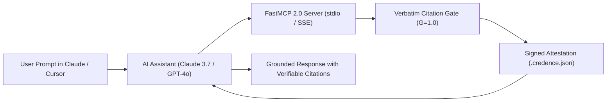

# Tutorial 03: FastMCP 2.0 with Claude & Cursor

Give your AI coding assistant or autonomous research agent an epistemic brake. Learn how to configure **Credence FastMCP 2.0** so Claude Desktop and Cursor can verify web pages before ingesting text.

---

## 1. FastMCP Architecture for AI Agents



---

## 2. Configuring Claude Desktop

Edit your `claude_desktop_config.json`:

```json
{
  "mcpServers": {
    "credence": {
      "command": "credence",
      "args": ["serve", "--transport", "stdio"]
    }
  }
}
```

Restart Claude Desktop. You will now see the `credence` hammer icon with tools available:
- `credence_check_url`: Audits any live webpage.
- `credence_evaluate_text`: Audits prose without web scraping.
- `credence_discover_feeds`: Autonomously discovers RSS/Atom endpoints.
- `credence_inspect_feed_health`: Runs pre-flight topic entropy forensic audits.
- `credence_generate_digest`: Pulls 24-hour morning epistemic intelligence digests.

---

## 3. Remote SSE Server for Multi-Agent Swarms

For multi-agent clusters or remote services, launch FastMCP in Server-Sent Events mode:

```bash
# Start SSE server on port 8000
credence serve --transport sse --port 8000
```

Connect your agents to `http://localhost:8000/sse` or `https://mcp.credence.run/sse`.

---

## 4. Testing Live Tools in Claude

Ask Claude:

> *"Audit https://arstechnica.com/feed using Credence and summarize the top clean investigative articles from the morning digest."*

Claude will invoke `credence_generate_digest` and format a structured, zero-hallucination executive brief backed by cryptographic Ed25519 signatures.
