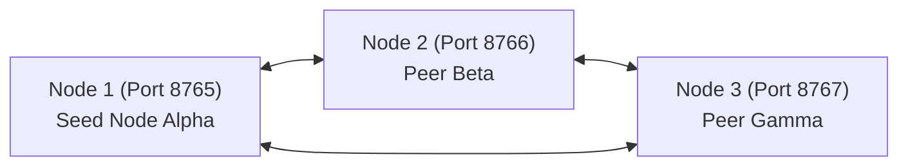

# Tutorial 05: 3-Node Mesh Quickstart

Learn how to boot a 3-node local P2P mesh cluster, divide syndicated feeds across peers using Rendezvous Hashing, and verify how Node 2 and Node 3 adopt pre-ingested audit attestations at **$0.00 token cost**.

---

## 🏛️ 3-Node Small Mesh Topology



---

## 1. Booting Node 1 (Bootstrap Seed)

In Terminal 1:
```bash
credence mesh start --port 8765 --node-id "seed-node-alpha"
```

---

## 2. Booting Node 2 & Node 3

In Terminal 2:
```bash
credence mesh start --port 8766 --peer "ws://127.0.0.1:8765" --node-id "peer-beta"
```

In Terminal 3:
```bash
credence mesh start --port 8767 --peer "ws://127.0.0.1:8765" --node-id "peer-gamma"
```

---

## 3. Auditing on Node 1 & Adopting on Nodes 2 & 3

1. **Trigger Audit on Node 1**:
   ```bash
   credence audit https://example.com/breaking-story --profile BALANCED
   ```
2. **Observe Zero-Token Adoption on Node 2**:
   ```bash
   credence lookup https://example.com/breaking-story
   # Output: [CACHE_HIT / MESH_ADOPTION] Tokens Burned: 0 ($0.00)
   ```

Both nodes now hold cryptographically identical, Ed25519-verified truth records without paying double inference fees.
