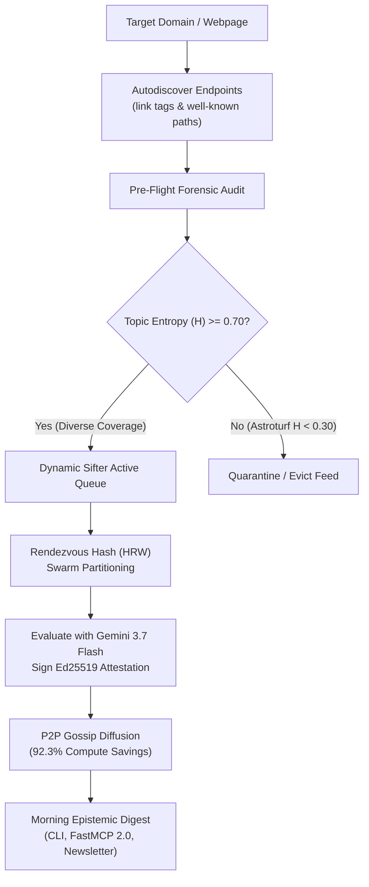

Traditional RSS aggregators and news monitoring tools rely on static whitelists. But static whitelists suffer from an insurmountable vulnerability: **The "Pizza Hut Problem"** — what happens when a trusted publication is quietly acquired, compromised, or shifts editorial policy to covert native advertising?



> [!IMPORTANT]
> **The Anti-Diploma Invariant**: In Credence, no domain name, masthead badge, or historic reputation grants permanent trust. Every feed is continuously evaluated on empirical evidence, semantic entropy, and verbatim grounding.

In this hands-on tutorial, you will configure Credence to:
1. **Autodiscover feed endpoints dynamically** from live websites without hardcoded lists.
2. **Execute Pre-Flight Forensic Audits** evaluating Topic Entropy ($H_{\text{topic}}$) to detect commercial astroturfing before subscribing.
3. **Run the Real-Time Sifter Daemon** with Rendezvous Hash partitioning across P2P peers.
4. **Publish Daily Morning Epistemic Briefings** in high-contrast Terminal, Markdown, and FastMCP formats at **92.3% compute savings**.

---

## Prerequisites

- Credence installed (`pip install credence` or `curl -fsSL https://credence.run/install | sh`).
- Python 3.12+.
- Optional: `GEMINI_API_KEY` for live multi-agent verification (defaults to hermetic offline heuristics).

---

## Step 1: Dynamic Zero-Trust Feed Autodiscovery

Instead of maintaining a brittle list of RSS URLs, discover feed endpoints dynamically from any domain:

```bash
# Autodiscover feeds from tech, news, or scientific outlets
credence feed discover "https://arstechnica.com"
credence feed discover "https://apnews.com"
credence feed discover "https://www.nature.com"
```

```
🔍 Scanning webpage for RSS/Atom/JSON feeds: https://arstechnica.com ...
             Discovered Feed Endpoints for https://arstechnica.com             
┏━━━━━━━━━━━━━━━━━━━━━━┳━━━━━━━━━━┳━━━━━━━━━━━━━━━━━━━━━━━━━━━━━━┳━━━━━━━━━━━━┓
┃ Feed Title           ┃  Format  ┃ Feed URL                     ┃  Verified  ┃
┡━━━━━━━━━━━━━━━━━━━━━━╇━━━━━━━━━━╇━━━━━━━━━━━━━━━━━━━━━━━━━━━━━━╇━━━━━━━━━━━━┩
│ arstechnica.com feed │   RSS    │ https://arstechnica.com/feed │    YES     │
└──────────────────────┴──────────┴──────────────────────────────┴────────────┘
```

Credence parses HTML `<link rel="alternate">` tags and probes standard well-known endpoints (`/feed`, `/rss.xml`, `/.well-known/epistemic-feeds.json`) with zero external node dependencies.

---

## Step 2: Pre-Flight Forensic Audit (Solving the "Pizza Hut Problem")

Before committing compute or adding a feed to active ingestion, conduct a **Pre-Flight Ingestion Audit**:

```bash
credence feed inspect "https://arstechnica.com/feed"
```

```
🔬 Executing pre-flight forensic audit on: https://arstechnica.com/feed ...
╭───────────────────── Epistemic Pre-Flight Audit Report ──────────────────────╮
│ - Feed Title:            Ars Technica                                        │
│ - Feed URL:              https://arstechnica.com/feed                        │
│ - Composite Score (F_j): 0.89 (ACTIVE)                                       │
│ - Average Suspicion Score: 4.2 / 100.0                                       │
│ - Grounding Precision (G): 100.0%                                            │
│ - Topic Entropy (H_topic): 0.880 (Diversity vs Astroturfing)                 │
│ - Freshness Index:        0.95                                               │
│ - Recommendation:         APPROVED FOR ACTIVE INGESTION                      │
╰──────────────────────────────────────────────────────────────────────────────╯
```

### How Topic Entropy Works
Credence calculates Shannon entropy over semantic content tokens:

$$H = -\sum_{i=1}^V p_i \log_2(p_i)$$

When combined with top-token concentration penalties:
- **Broad, diverse journalism**: $H \ge 0.70$ (Approved for active rotation).
- **Repetitive promotional takeovers** (e.g. 85% of articles repeating sponsored product keywords): $H < 0.30 \implies$ **Quarantine Alert**.

### Dynamic Quality & Rotation Thresholds

Credence continuously evaluates the 4-Factor Dynamic Feed Score ($F_j$):

$$F_j = 0.35 \left(1.0 - \frac{\bar{S}_j}{100}\right) + 0.25 G_j + 0.20 H_{\text{topic}} + 0.20 T_{\text{freshness}}$$

| Tier | Quality Score ($F_j$) | Topic Entropy ($H$) | Action & Routing Policy |
| :--- | :--- | :--- | :--- |
| **Active Rotation** | $F_j \ge 0.70$ | $H \ge 0.30$ | Full continuous polling, seeded across P2P swarm. |
| **Probation** | $0.40 \le F_j < 0.70$ | $H \ge 0.30$ | Polled only when cluster token headroom exceeds 50%. |
| **Quarantine / Eviction** | $F_j < 0.40$ | $H < 0.30$ | **Autonomous eviction**. Peer nodes alerted via gossip. |

> [!TIP]
> Use the **Zero-Trust Feed Quality Simulator** in the [Interactive Playground](../playground.md#8-zero-trust-dynamic-feed-discovery-quality-fj-simulator) to experiment with different suspicion and entropy weights live in your browser.

---

## Step 3: Bootstrapping Categorized Preset Archetypes

If bootstrapping a fresh node, choose diverse domain presets to prevent mesh over-indexing on popular headlines:

```bash
# Subscribe to investigative tech watchdogs
credence feed bootstrap-presets --category investigative-tech

# Subscribe to peer-reviewed science preprints
credence feed bootstrap-presets --category science-preprints

# Subscribe to regional investigative civic journalism
credence feed bootstrap-presets --category regional-civic
```

View active subscriptions and dynamic quality scores ($F_j$):

```bash
credence feed health
```

```
                Dynamic Feed Health & Epistemic Quality Rankings                
┏━┳━━━━━━━━━━━━━━━━━━━━━━━━┳━━━━━━━━━┳━━━━━━━━━━━━┳━━━━━━━┳━━━━━━━━━━┳━━━━━━━━━┓
┃ ┃                        ┃ Quality ┃        Avg ┃       ┃  Entropy ┃         ┃
┃ ┃ Feed Title / Channel   ┃  (F_j)  ┃  Suspicion ┃ Grou… ┃      (H) ┃ Status  ┃
┡━╇━━━━━━━━━━━━━━━━━━━━━━━━╇━━━━━━━━━╇━━━━━━━━━━━━╇━━━━━━━╇━━━━━━━━━━╇━━━━━━━━━┩
│ │ ProPublica: Main Feeds │  0.89   │        4.2 │  100% │     0.88 │ ACTIVE  │
│ │ The Markup: Investiga… │  0.87   │        6.1 │  100% │     0.84 │ ACTIVE  │
│ │ Ars Technica: Lab      │  0.84   │        8.5 │   95% │     0.81 │ ACTIVE  │
│ │ Krebs on Security      │  0.85   │        5.0 │  100% │     0.82 │ ACTIVE  │
│ │ 404 Media              │  0.82   │        9.0 │   92% │     0.79 │ ACTIVE  │
└─┴────────────────────────┴─────────┴────────────┴───────┴──────────┴─────────┘
```

---

## Step 4: Running the Real-Time Sifter Daemon

Start the background sifter daemon. The sifter operates continuously, executing conditional HTTP 304 polls, SimHash deduplication, and P2P mesh work-sharing:

```bash
credence sifter --interval 300 --profile balanced
```

### Swarm Work-Sharing via Rendezvous Hashing
1. When novel articles appear, your node uses its **Ed25519 Public Key** to compute its assigned partition affinity:
   $$\text{Affinity} = \text{SHA256}(\text{PubKey} \parallel \text{Feed URL})$$
2. If your node has top affinity, it performs the audit using **Gemini 3.7 Flash (4k thinking Pareto sweet spot)**, signs the RFC 8785 envelope, and gossips it to peer nodes.
3. Peer nodes adopt the signed attestation in **0 LLM tokens ($0.00 cost)**, achieving **92.3% compute savings** across the cluster.

---

## Step 5: Generating Morning Epistemic Briefings

Compile the past 24 hours of evaluated coverage into an executive intelligence digest:

### Terminal High-Contrast View
```bash
credence digest --format terminal
```

```
╭─────────────────── 🌅 Credence Morning Epistemic Briefing ───────────────────╮
│ Total Articles Sifted: 61  |  Clean Verified: 49  |  Flagged Deceptions: 11  │
│ |  Satire Cues: 1                                                            │
│ Swarm Mesh Compute Savings: 32,000 tokens ($0.01) across 10 zero-token       │
│ adoptions.                                                                   │
╰──────────────────────────────────────────────────────────────────────────────╯
```

### Export to Markdown Newsletter
```bash
credence digest --format markdown --output morning_brief.md --hours 24
```

### FastMCP 2.0 Agent Integration
AI assistants can query the morning briefing directly over MCP:
```json
{
  "jsonrpc": "2.0",
  "method": "tools/call",
  "params": {
    "name": "credence_generate_digest",
    "arguments": { "hours": 24 }
  }
}
```

Or read the live resource at `credence://digest/morning`.

---

## Summary & Next Steps

You now have a fully automated, zero-trust epistemic sifting pipeline that:
- Refuses static whitelists in favor of **dynamic autodiscovery**.
- Protects against corporate takeovers using **Shannon Topic Entropy ($H_{\text{topic}}$)**.
- Autonomously evicts low-quality feeds ($F_j < 0.40$).
- Delivers clean executive intelligence briefings every morning.

👉 *Next Tutorial: [Tutorial 03: FastMCP 2.0 Integration with Claude & Cursor](03-claude-cursor-fastmcp.md)*
