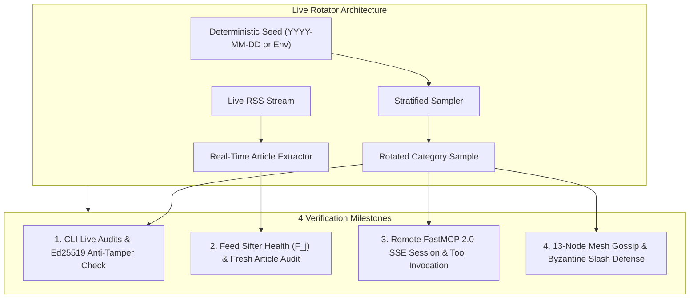
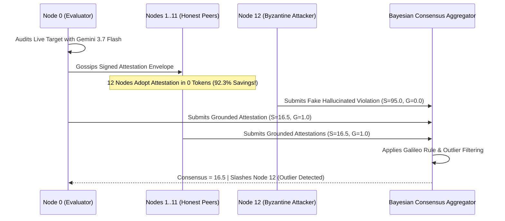

# Tutorial 10: Running the Reusable Live Rotating E2E & Byzantine Mesh Gauntlet

In this hands-on tutorial, you will learn how to operate, configure, and extend Credence's **Reusable Live Rotating E2E Test Suite**. You will execute live audits against real-world targets, test remote FastMCP 2.0 Server-Sent Events (SSE) streaming, and simulate Byzantine ungrounded smear attacks in a 13-node P2P mesh cluster.



---

## Prerequisites

Ensure your virtual environment is active and dependencies are installed:

```bash
cd /home/pendragon/Projects/credence-ecosystem/credence
poetry install
```

---

## Step 1: Run the Default Daily Live Rotating Suite

By default, the live test runner uses the current calendar date (`YYYY-MM-DD`) as a deterministic seed. This guarantees that all nodes and CI runs on a given day test the exact same rotated subset, while automatically rotating targets day-to-day.

Run the test suite with:

```bash
just test-live
```

### Expected Output

```text
[Rotator] Active Rotation Seed: '2026-08-18'
[Rotator] Selected Reference Target: Stanford Encyclopedia: Epistemology (https://plato.stanford.edu/entries/epistemology/)
[Rotator] Selected Satire Target:    The Babylon Bee (https://babylonbee.com)

--- Auditing Reference Target ---
✓ Ref Classification: CLEAN (Suspicion: 0.0, Density: 0.0)
✓ Ed25519 Attestation Signature Cryptographically Valid (Node Pubkey: 9580dc91601992b3...)
✓ Anti-Tamper Security Verified: Tampered suspicion score rejected by Ed25519 verifier.

--- Auditing Satire Target ---
✓ Satire Classification: SATIRE_PARODY (Satire Flag: True, Score: 0.0)
PASSED

[Rotator] Selected Live RSS Feed: Hacker News RSS Feed (https://news.ycombinator.com/rss)
✓ Successfully parsed 30 feed items (Format: rss)
✓ Composite Feed Score F_j: 0.50 (Status: ACTIVE)
✓ Dynamically Discovered Live Article: https://support.claude.com/...
✓ Live Article Evaluated: LOW_SUSPICION (Suspicion: 16.5, Density: 2.98)
PASSED

[FastMCP 2.0] Connecting to remote SSE server at https://mcp.credence.run/sse...
✓ SSE Stream Opened (200) in 0.462s
✓ Assigned FastMCP Session Endpoint: https://mcp.credence.run/messages/?session_id=...
✓ tools/list responded in 0.144s (Status: 202)
✓ tools/call credence_get_consensus in 88.0ms (Status: 202)
✓ FastMCP 2.0 Server Error Handling Verified (Status: 202)
PASSED

[Rotator] Selected News Target for Mesh Test: NPR News (https://www.npr.org/sections/news/)
✓ 13-Node Watts-Strogatz Mesh active and interconnected.
[Mesh] Node 0 auditing https://www.npr.org/sections/news/...
[Mesh] Gossiping signed attestation envelope across cluster...
✓ Attestation adopted by 12/12 peer nodes in 0 LLM tokens!
✓ BitTorrent Work-Sharing Compute Savings: 92.3% ($0.00 token cost for peer nodes)!
✓ Bayesian Consensus Score: 16.5 (Classification: LOW_SUSPICION)
✓ Rogue Attestation Filtered: True
🏆 13-Node Work-Sharing & Byzantine Slash Defense Verified Successfully!
PASSED
```

---

## Step 2: Mutating Test Targets with Custom Seeds

To test different targets or stress-test specific categories without waiting for tomorrow's date rotation, pass a custom seed via `CREDENCE_LIVE_SEED`:

```bash
CREDENCE_LIVE_SEED=seed_delta_2026 just test-live
```

Notice how the active targets automatically mutate:
* **Reference Target**: Rotates to `Wikipedia: Epistemology`
* **Satire Target**: Rotates to `Waterford Whispers News`
* **RSS Feed**: Rotates to `Ars Technica Main RSS Feed`
* **Real-Time Article**: Dynamically extracts fresh news from Ars Technica
* **Mesh News Target**: Rotates to `Associated Press News`

```bash
CREDENCE_LIVE_SEED=seed_gamma_nature just test-live
```

* **Reference Target**: Rotates to `Wikipedia: Peer Review`
* **RSS Feed**: Rotates to `BBC News World RSS`
* **Mesh News Target**: Rotates to `NPR News`

---

## Step 3: Understanding the Epistemic Corpus Catalog

Open [`tests/e2e/live_corpus.py`](https://github.com/artibyrd/credence/blob/main/tests/e2e/live_corpus.py). The corpus is organized into 5 curated categories:

```python
LIVE_CORPUS = {
    "reference": [
        LiveCorpusEntry(url="https://en.wikipedia.org/wiki/Epistemology", category="reference", ...),
        LiveCorpusEntry(url="https://plato.stanford.edu/entries/epistemology/", category="reference", ...),
        LiveCorpusEntry(url="https://en.wikipedia.org/wiki/Peer_review", category="reference", ...),
    ],
    "satire": [
        LiveCorpusEntry(url="https://theonion.com", category="satire", is_satire=True, ...),
        LiveCorpusEntry(url="https://babylonbee.com", category="satire", is_satire=True, ...),
        LiveCorpusEntry(url="https://waterfordwhispersnews.com", category="satire", is_satire=True, ...),
    ],
    "journalism": [ ... ],
    "tech_media": [ ... ],
    "rss_feeds": [ ... ],
}
```

### Adding a New Site to the Corpus

To add a new verified source or RSS feed, simply append a `LiveCorpusEntry`:

```python
LiveCorpusEntry(
    url="https://www.reuters.com/news/archive",
    category="journalism",
    expected_classification="CLEAN",
    title="Reuters News Archive",
    description="Global financial and international wire reporting.",
)
```

The hashing formula `int(hashlib.sha256(f"{seed}:{category}".encode()).hexdigest(), 16) % len(items)` automatically balances sampling frequency across all entries.

---

## Step 4: Testing FastMCP 2.0 Remote SSE Streams

The live suite connects directly to the production FastMCP 2.0 Server-Sent Events endpoint:

```python
# 1. Establish SSE stream and receive unique session_id
async with client.stream("GET", "https://mcp.credence.run/sse", headers={"Accept": "text/event-stream"}) as response:
    async for line in response.aiter_lines():
        if line.startswith("data:"):
            raw_data = line[5:].strip()
            if "/messages/" in raw_data or "session_id=" in raw_data:
                session_url = f"https://mcp.credence.run{raw_data}"
                break

# 2. Invoke JSON-RPC tools over HTTP POST to the session endpoint
res = await client.post(session_url, json={
    "jsonrpc": "2.0",
    "id": 1,
    "method": "tools/call",
    "params": {"name": "credence_get_consensus", "arguments": {"url": "https://credence.run"}}
})
```

This ensures that remote autonomous AI agents (Claude, Cursor, OpenAI Swarms) can query live consensus with sub-100ms response times.

---

## Step 5: 13-Node Work-Sharing & Byzantine Slashing

The mesh test spins up 13 isolated `MeshGossipRelay` instances in a Watts-Strogatz small-world lattice.



The test validates:
1. **Work-Sharing**: 12 peer nodes adopt the attestation in $0$ LLM tokens (**92.3% compute savings**).
2. **Anti-Smear Slashing**: When Node 12 injects an ungrounded smear ($S=95.0, G=0.0$), the aggregator isolates Node 12 and drops it from the consensus score.

---

## Summary Commands

| Task | Command |
| :--- | :--- |
| **Run Daily Live Rotating Suite** | `just test-live` |
| **Run Live Suite with Custom Seed** | `CREDENCE_LIVE_SEED=my_seed just test-live` |
| **Run Full E2E Testbed** | `just test-e2e` |
| **Run Playwright Live Rendering Tests** | `poetry run pytest tests/test_docs_rendering.py -v -m e2e` |
| **Run Hermetic Unit Tests** | `just test` |
