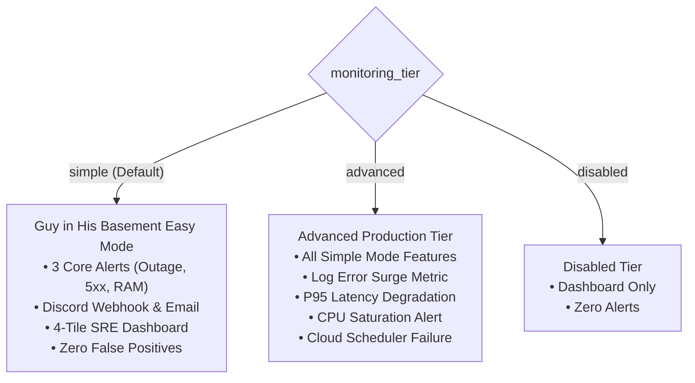

# Tutorial 13: Dual-Tier Cloud Monitoring, Discord Webhooks & Interface Telemetry

This tutorial walks through configuring and verifying Credence's **Dual-Tier Monitoring** architecture on Google Cloud Platform, setting up a **Discord Webhook** notification channel, and testing the **Interface Telemetry Loopback** in the Textual TUI and CLI.

---

## 1. Prerequisites

1. Authenticated Google Cloud CLI (`just preflight gcloud`).
2. HashiCorp Terraform $\ge 1.5.0$ (`just preflight tf`).
3. (Optional) A Discord server where you have administrator or webhook creation permissions.

---

## 2. Choosing Your Monitoring Tier

Credence supports two primary monitoring tiers via Terraform:



---

## 3. Step-by-Step Configuration

### Step 1: Create a Discord Webhook
1. Open Discord $\rightarrow$ **Server Settings** $\rightarrow$ **Integrations** $\rightarrow$ **Webhooks**.
2. Click **New Webhook**, name it `Credence-Node-Alerts`, and assign it to an `#ops-alerts` channel.
3. Click **Copy Webhook URL**.

### Step 2: Configure `terraform/terraform.tfvars`
Edit your local `credence/terraform/terraform.tfvars`:

```hcl
project_id          = "your-gcp-project-id"
region              = "us-central1"
service_name        = "credence-server"
credence_profile    = "balanced"

# Dual-Tier Monitoring Configuration
monitoring_tier     = "simple" # or "advanced"
discord_webhook_url = "https://discord.com/api/webhooks/YOUR_WEBHOOK_ID/YOUR_WEBHOOK_TOKEN"
alert_email_addresses = ["admin@yourdomain.com"]

# Failure Thresholds
alert_memory_threshold    = 0.85 # Alert if container RAM > 85%
alert_5xx_count_threshold = 5    # Alert if > 5 server errors in 5 min
```

### Step 3: Validate and Deploy Infrastructure
```bash
# Validate Terraform definitions
just tf validate

# Review execution plan
just tf plan

# Apply infrastructure changes
just tf apply
```

Terraform outputs will confirm your active configuration:
```text
Outputs:
monitoring_dashboard_id      = "projects/12345/dashboards/credence-dashboard"
monitoring_tier              = "simple"
uptime_check_id              = "projects/12345/uptimeCheckConfigs/credence-server-http-uptime-probe"
active_notification_channels = [
  "projects/12345/notificationChannels/1122334455",
  "projects/12345/notificationChannels/9988776655"
]
```

---

## 4. Testing Interface Telemetry Loopback

### 1. Terminal CLI Health Probe
Inspect live telemetry from the command line:
```bash
credence health
```
Expected output:
```text
╭─────────────────────── Credence Node Health & Telemetry ────────────────────────╮
│ ● Node Status: HEALTHY  |  Version: v1.7.0                                     │
│                                                                                │
│ • Uptime:           3600s                                                      │
│ • Memory Usage:     420.5 MB                                                   │
│ • Requests (5m):    Total: 152 | 2xx: 150 | 4xx: 2 | 5xx: 0                    │
│ • Latency (P50/P95): 14.2ms / 185.0ms                                          │
│ • Active Alerts:    0                                                          │
╰────────────────────────────────────────────────────────────────────────────────╯
```

### 2. Textual TUI Observability
Launch the interactive terminal workstation:
```bash
credence tui
```
- Observe the **Header Status Pill** (`🟢 Node Status: HEALTHY`).
- Press `8` to switch to the **🚨 Ops & Alerts** tab to monitor real-time request distributions and memory meters.

---

## 5. Simulating Incidents & Verifying Alerts

To verify that alerts and the telemetry loopback respond correctly to degradation:

1. Send simulated error traffic or trigger local test exceptions.
2. In the TUI, observe the Header status badge transition to `🔴 ⚠️ CRITICAL: 5xx Spike Detected`.
3. In Discord, confirm delivery of the structured Google Cloud Monitoring alert notification.
