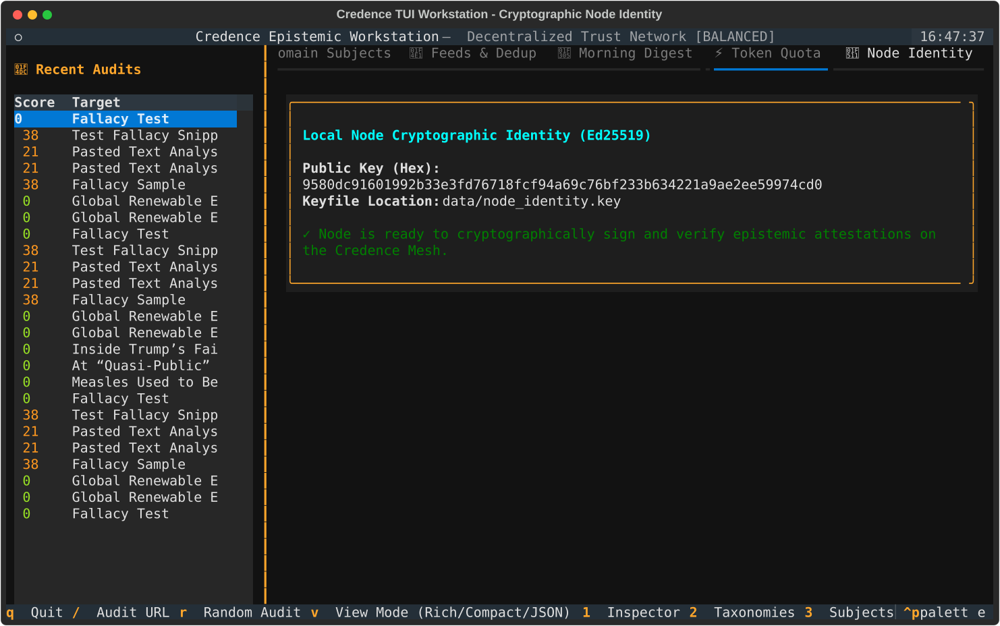
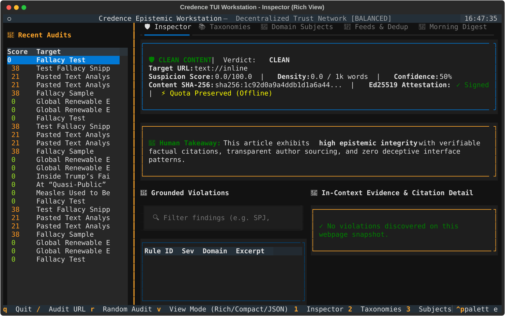
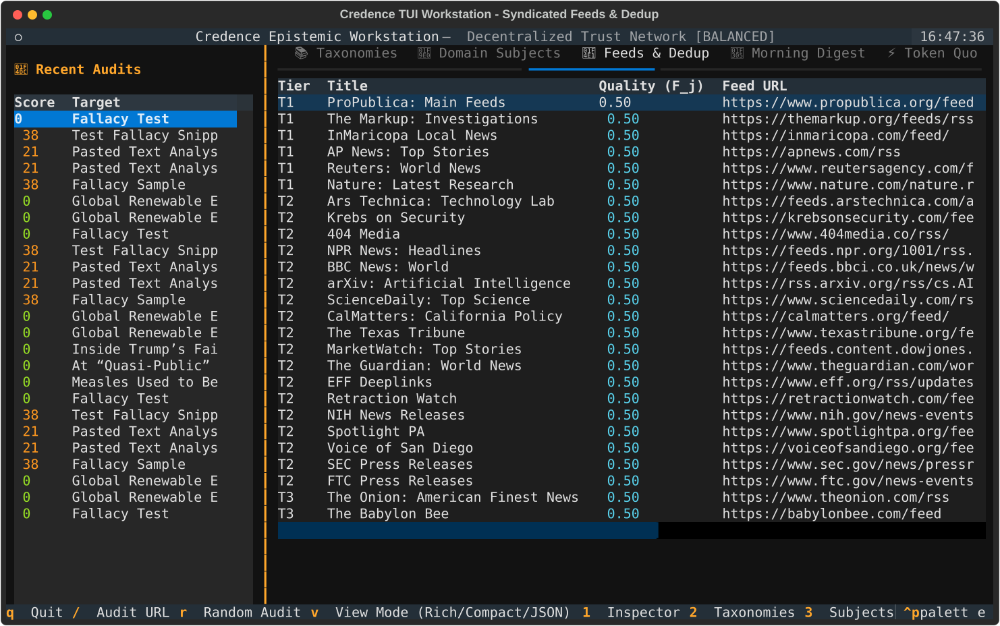

# Feature Walkthrough: P2P Mesh Gossip & Bayesian Consensus

Learn how Credence nodes establish cryptographic identity, exchange attestations over Watts-Strogatz small-world lattices, and aggregate Byzantine-resistant consensus using Domain Authority Weighted Medians.

> [!NOTE]
> **Persistent Interface Preference**: Selecting your preferred interface below automatically applies across all feature walkthroughs and tutorials in the portal.

---

## 1. Generating Node Identity & Ed25519 Keys

Establish a sovereign cryptographic node identity.

:::tabs
=== CLI Keygen
```bash
# Generate a new Ed25519 node keypair
credence identity generate

# View local node identity, public key, and reputation stats
credence identity show
```

=== Python SDK
```python
from credence.identity import generate_node_keypair, serialize_public_key

private_key = generate_node_keypair()
public_key = private_key.public_key()

pub_hex = serialize_public_key(public_key)
print(f"Node Public Key: {pub_hex}")
```

=== Air-Gapped Ceremony
```bash
# On an offline, air-gapped machine:
poetry run python -c "
from credence.identity import generate_node_keypair
from cryptography.hazmat.primitives import serialization

priv = generate_node_keypair()
print('Air-gapped seed key generated.')
"
```

=== 📟 Textual TUI Workstation
1. Launch `credence tui`.
2. Press `6` to switch to the **🔑 Node Identity** tab.
3. Review your node's local Ed25519 Public Key (Hex), private keyfile path, and cryptographic attestation readiness.


:::

---

## 2. Querying Bayesian Multi-Node Consensus

Aggregate evaluations across peer nodes to compute a Domain Authority Weighted Median with Galileo Rule protection.

:::tabs
=== CLI
```bash
# Query consensus by content SHA-256 hash
credence consensus query "8f4e2b8c9d1a3e5f7b2c4d6e8a0b1c3d5e7f9a1b3c5d7e9f1a3b5c7d9e1f3a5b"

# Query consensus with domain authority weighting
credence consensus query "8f4e2b8c..." --subject "journalism.investigative"
```

=== FastMCP 2.0 (Claude / Cursor)
```json
{
  "jsonrpc": "2.0",
  "method": "tools/call",
  "params": {
    "name": "credence_get_consensus",
    "arguments": {
      "content_sha256": "8f4e2b8c9d1a3e5f7b2c4d6e8a0b1c3d5e7f9a1b3c5d7e9f1a3b5c7d9e1f3a5b",
      "subject_id": "journalism.investigative"
    }
  }
}
```

=== Python SDK
```python
from credence.consensus import compute_weighted_consensus

consensus_result = await compute_weighted_consensus(
    content_sha256="8f4e2b8c9d1a3e5f7b2c4d6e8a0b1c3d5e7f9a1b3c5d7e9f1a3b5c7d9e1f3a5b",
    subject_id="journalism.investigative"
)

print(f"Consensus Score: {consensus_result.score}")
print(f"Participating Peers: {consensus_result.node_count}")
print(f"Galileo Rule Triggered: {consensus_result.galileo_override}")
```

=== 📟 Textual TUI Workstation
1. In `credence tui`, press `1` to open the active **🛡️ Inspector**.
2. Select any recent audit to observe whether peer attestation consensus was reached or if the Galileo Rule override was invoked.
3. Press `v` to view the canonical multi-node signatures in the raw RFC 8785 envelope.


:::

---

## 3. Live Mesh Monitoring & Gossip Visualizer

Inspect the 13-node Watts-Strogatz topology and real-time gossip propagation.

:::tabs
=== 📟 Textual TUI Workstation
1. Launch `credence tui`.
2. Press `4` to switch to **📡 Feeds & Dedup** to view live peer adoptions and effort avoidance.
3. Observe real-time sync indicators reporting zero-token peer attestation exchanges.



=== Interactive Web Visualizer
1. Open the [Interactive 13-Node Mesh Simulator](../playground.md#1-13-node-watts-strogatz-mesh-gossip-simulator) in your browser.
2. Click **Broadcast Attestation from Node 1** to observe 3-hop epidemic gossip diffusion.
3. Click **Simulate Barbell Network Split** to test netsplit self-healing.

=== CLI Health
```bash
# Inspect mesh connection health and active peer count
credence mesh peers
credence mesh health
```
:::

---

## 4. Consensus Properties & Mathematical Invariants

| Consensus Property | Formula / Metric | Invariant Reference |
| :--- | :--- | :--- |
| **Composite Weight ($W_i$)** | $W_i = 0.20 Q_i + 0.80 E_{i, \text{domain}}$ | [Invariant 17](../invariants.md#invariant-17) (Anti-Diploma) |
| **Galileo Override** | $G=1.00 \land W_i \ge 0.70 \implies \text{is\_outlier} = \text{False}$ | [Invariant 27](../invariants.md#invariant-27) (Galileo Rule) |
| **Sybil Resistance** | Requires domain entropy across $\ge 5$ distinct FQDNs | [Invariant 28](../invariants.md#invariant-28) ($3f+1$ Cartel Defense) |
| **Slashing Penalty** | $W_i \leftarrow 0.50 W_i$ on ungrounded findings | [Invariant 22](../invariants.md#invariant-22) (Hallucination Slash) |

> [!IMPORTANT]
> **The Galileo Rule Invariant**: Absence of evidence is not evidence of absence. Verified domain authorities submitting 100% grounded citations cannot be silenced by uninformed swarms.
